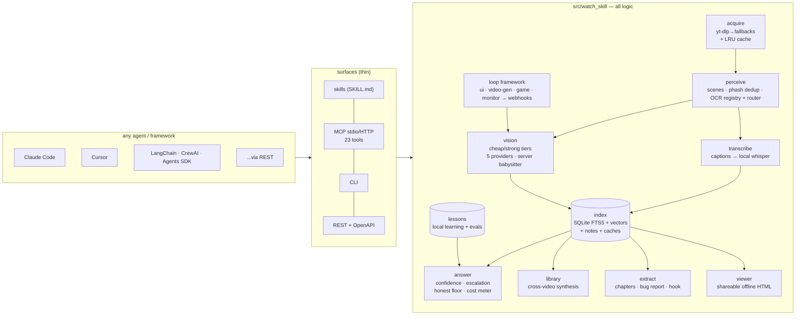

<div align="center">

# Watch Skill

**Video skills for every AI agent, with memory.**

Agents can act on screens now — they browse, click, type, and screenshot.
A screenshot shows a moment; it cannot show a flow. Watch Skill is the
independent eye: it turns any video — a URL from 1800+ sites, a live
stream, a local file, a meeting recording, or the browser session an
agent just drove — into a persistent, searchable memory of frames,
on-screen text, and transcript, then answers with auditable confidence
and timestamp citations, verifies flows against plain-language criteria,
and gets measurably better with every video it watches. One engine,
every surface: skills, MCP (23 tools), CLI, REST, and native framework
adapters.


*THE LOOP, live: iteration 0 flags `TOTAL: $NaN` as critical with a
suggested fix → the agent fixes the code → iteration 1 verifies FIXED and
renders this GIF. The same machinery verifies browser-agent sessions,
video generators, gameplay, and monitored streams.*

[](https://github.com/oxbshw/watch-skill/actions/workflows/ci.yml)
[](LICENSE)
[](pyproject.toml)

</div>

---

## 60-second quickstart

**Claude Code (one command):**

```
/plugin marketplace add oxbshw/watch-skill
/plugin install watch-skill@watch-skill
```

That installs the seven-skill library (`watching-videos`,
`asking-with-evidence`, `the-loop`, `video-memory`, and friends — they
trigger on their own when a video URL or a "why does my UI look wrong"
shows up) plus the MCP server, for ~805 always-on tokens measured. Then
run `/watch-skill:setup-watch-skill` once — it installs the engine,
self-heals the binary deps, registers the MCP server in **every** agent
on your machine (each with a config backup), and offers a vision backend.

**Everywhere else (one-liner installers):**

```bash
# macOS / Linux
curl -fsSL https://raw.githubusercontent.com/oxbshw/watch-skill/main/scripts/install.sh | sh
```

```powershell
# Windows
powershell -ExecutionPolicy Bypass -c "irm https://raw.githubusercontent.com/oxbshw/watch-skill/main/scripts/install.ps1 | iex"
```

Both bootstrap uv/Python if missing and run the same doctor + multi-agent
setup. Then:

```bash
watch-skill watch "https://youtu.be/..." "what happens in this video?"
watch-skill ask <video_id> "when exactly does the demo crash?"
watch-skill library ask "what did the meetings decide about the pricing page?"
watch-skill serve            # MCP stdio (--http for streamable HTTP)
```

**Vision is effectively free.** Transcription and search need no key at
all (local Whisper, offline). For scene descriptions and visual Q&A,
`watch-skill setup-vision --provider gemini --api-key <key>` uses
Gemini's free tier, or `--provider ollama` runs fully offline with a
model sized to your RAM. The cost pages below carry the measured
numbers.

## Works with your agent

Statuses are honestly graded — **machine-tested ✅** (full end-to-end
run), **machine-configured ◐** (config written + MCP initialize answered
on a real machine), **doc-verified ☑** (matches current official docs,
not executed here; every config block is machine-parsed in CI).

| Agent | Surface | Status |
|-------|---------|--------|
| [Claude Code](docs/agents/claude-code.md) | plugin (skills + MCP) | machine-tested ✅ |
| [Claude Desktop](docs/agents/claude-desktop.md) | MCP (stdio) | machine-configured ◐ |
| [Cursor](docs/agents/cursor.md) | MCP (stdio) | machine-configured ◐ |
| [Codex CLI](docs/agents/codex-cli.md) | MCP (stdio) | machine-configured ◐ |
| [Cline](docs/agents/cline.md) · [Windsurf](docs/agents/windsurf.md) · [Gemini CLI](docs/agents/gemini-cli.md) · [VS Code Copilot](docs/agents/vscode.md) | MCP (stdio) | doc-verified ☑ |
| [GitHub Copilot CLI](docs/agents/github-copilot-cli.md) · [Kimi Code](docs/agents/kimi-code.md) · [Qwen Code](docs/agents/qwen-code.md) · [OpenCode](docs/agents/opencode.md) | MCP (stdio) | doc-verified ☑ |
| [Goose](docs/agents/goose.md) · [OpenHands](docs/agents/openhands.md) · [Kilo Code](docs/agents/kilocode.md) · [Qodo](docs/agents/qodo.md) · [Agent Zero](docs/agents/agent-zero.md) | MCP (stdio) | doc-verified ☑ |
| [OpenClaw](docs/agents/openclaw.md) · [Pi](docs/agents/pi.md) · [Hermes-style](docs/agents/hermes.md) | skills / `AGENTS.md` | doc-verified ☑ |
| **LangChain / LangGraph** · **CrewAI** · **OpenAI Agents SDK** | [native tools](docs/agents/frameworks.md) | machine-tested ✅ |
| LlamaIndex · AutoGen (v0.4+) | [native tools](docs/agents/frameworks.md) | unit-tested ◐ |
| Anything with HTTP | REST + OpenAPI (`watch-skill api`) | machine-tested ✅ |

Full matrix — 24 rows with per-agent install, config, and smoke tests:
[docs/agents/README.md](docs/agents/README.md). Yours missing?
[Add it in ~20 minutes](templates/agent-adapter/README.md).

## The seven claims (each with a receipt)

**Everywhere.** The skills library above installs superpowers-style into
Claude Code today and rides into any harness that reads SKILL.md
directories; MCP config covers most of the rest, `AGENTS.md` covers
agents with nothing but instructions and a shell, REST covers everything
else. The matrix is graded, validated, and open to contributions.

**Remembers.** Every watch distills notes — entities, claims, chapters,
each carrying (video, timestamp) provenance — into the same persistent
index, incrementally. `library_synthesize` answers questions no single
video holds, with per-video citations: in the
[live example](examples/12-library-memory/), a four-clip incident story
("what caused the ERROR 502 and is it fixed?") comes back cited across
all four clips, corroborated, and the repeat is served from cache. No
session expiry, no re-processing; the library you build this month still
answers next month.

**Nearly free.** Every answer accounts for itself (`cost_breakdown` by
source, `stats --cost` lifetime, a dated price file), and the routing is
an explicit policy — `cheapest` (default), `quality_first`, or
`offline_only` where cloud never sees a frame. The committed
[cost benchmark](benchmarks/cost/RESULTS.md), measured on the 8 GB
CPU-only reference machine:

| approach | est. tokens | est. $ |
|---|---|---|
| watch-skill, fully offline | ~5,868 (measured; 5 cache hits) | $0.00 |
| raw frames into context | ~18,890 (computed, same index) | $0.0019 at the cheapest paid model |

~3× fewer tokens on a 15-frame toy corpus — the gap grows with every
frame a real video adds, and repeats are free.

**High-quality vision anywhere.** OCR backends form a registry
(rapidocr default, tesseract auto-routed only for the
Lao/Khmer/Myanmar/Tibetan gap rapidocr genuinely has, surya opt-in), and
a per-region router reads frames that mix writing systems. From the
committed [perception benchmark](benchmarks/perception/RESULTS.md):

| backend | mixed code+Arabic+CJK frame | Arabic RTL | CJK |
|---|---|---|---|
| best single OCR engine | 81% | 94% | 100% |
| **multi-script router** | **98%** | 88% | 100% |
| moondream (vision model) | 58% | 18% | 0% |

That last row is why perception is layered: a captioning model is a
useful witness and a terrible stenographer. The local vision server is
babysat — health-checked, restarted detached when dead, one settled
retry, and a structured `vision.server_down` with a fix instead of an
empty string (the kill-the-server drill is a recorded demo).

**Heals itself.** `watch-skill doctor --fix` repairs every failure class
this project has actually hit: dead local vision server, corrupt cached
answers (quarantined), truncated model files, vanished frame
directories, stale locks, and it warns with a model recommendation when
commit headroom is too tight to load local vision. Every structured
error in the engine carries an actionable `fix` — enforced by an
AST-walking test, not by review vigilance.

**Improves itself.** Corrections become classified lessons; lessons
steer future answers (verify-prompt injection + adaptive profiles);
recovered evidence lands permanently in the index; and
`lessons eval --report` replays every lesson against the current
pipeline — classifying each still-effective, prunable, or regressed —
with `--prune` retiring what the pipeline outgrew. Mechanics, no
mysticism: [how it improves itself](docs/guides/how-it-improves-itself.md),
demo in [examples/13](examples/13-self-improvement/).

**Useful to everyone.** Seven [use-case packs](docs/packs/README.md) —
recipes over existing tools with runnable examples: browser-agent
verification (the flagship: a checkout total that reads $NaN for 1.5
seconds mid-flow and looks perfect in the end-state screenshot —
[examples/14](examples/14-browser-verification/)), QA bug hunting,
content creators, learning/research, meetings, monitoring/ops with
HMAC-signed webhooks built for n8n/Zapier wiring, and agent
self-verification.

## Examples

| Example | What it shows |
|---------|---------------|
| [01-watch-and-ask](examples/01-watch-and-ask) | Watch a URL, ask follow-ups from the index — the core loop |
| [02-focused-moment](examples/02-focused-moment) | Dense sampling of a `--start/--end` window, `get_moment` around a timestamp |
| [03-cross-video-search](examples/03-cross-video-search) | One query across every video ever watched |
| [04-ui-loop](examples/04-ui-loop) | THE LOOP: capture your own UI → critique → fix → re-verify with proof |
| [05-multilingual-arabic](examples/05-multilingual-arabic) | Arabic in, Arabic out: script-aware OCR, folded search, cross-lingual ask |
| [06-agent-integration](examples/06-agent-integration) | Wiring the MCP server / REST API into an agent |
| [07-lessons-and-stats](examples/07-lessons-and-stats) | report_mistake → lesson → replayable eval; the savings meter |
| [08-loop-types](examples/08-loop-types) | Video-gen, game, and monitor loops — each run live with a real vision critic |
| [09-framework-adapters](examples/09-framework-adapters) | Real watch+ask through LangChain, CrewAI, and the OpenAI Agents SDK |
| [10-structured-extraction](examples/10-structured-extraction) | Chapters, bug report, and hook analysis on one clip |
| [11-batch-mode](examples/11-batch-mode) | Index a small library in one call, answer a cross-video question |
| [12-library-memory](examples/12-library-memory) | A question no single video answers, synthesized with per-video citations |
| [13-self-improvement](examples/13-self-improvement) | Lessons classified against the live pipeline; prune what it outgrew |
| [14-browser-verification](examples/14-browser-verification) | The flagship: a flow bug no screenshot can catch, caught |

## Architecture

Thin surfaces, one core. `src/watch_skill` holds all logic; skills, MCP,
CLI, REST, and the framework adapters are wrappers that never diverge.



Deep dive: [docs/architecture.md](docs/architecture.md) — including "add
a vision provider in ~20 lines" and "add a new Loop type" (a producer
function + a registry entry).

## What makes it different

Watch Skill began as an attempt to surpass
[claude-video](https://github.com/bradautomates/claude-video) — the skill
that first gave Claude a video input, and the source of ideas we kept
(token-aware frame budgets, captions-first transcription, focused mode).
The strongest install story belongs to
[claude-video-vision](https://github.com/jordanrendric/claude-video-vision)
— two `/plugin` commands and a setup wizard that finds ffmpeg for you —
which describes itself, accurately, as "a perception layer, not an
interpretation layer". The closest cousin to our library layer is
[mcptube](https://github.com/0xchamin/mcptube), whose Karpathy-style wiki
genuinely compounds knowledge across YouTube videos — the right idea,
scoped to one site. And
[video-research-mcp](https://github.com/Galbaz1/video-research-mcp) is an
impressively broad Gemini-powered research suite whose evidence tiers
(Confirmed / Strong Indicator / Inference / Speculation) take answer
integrity seriously. Each of them holds one of the seven claims. None
holds two. The cells below come from each project's current README
(fetched 2026-07-11):

| | claude-video | claude-video-vision | mcptube | video-research-mcp | Watch Skill |
|---|---|---|---|---|---|
| Core idea | frames into context | frames + timestamped audio into context | YouTube → compounding wiki | Gemini research + media suite | **interpret + remember + verify + self-improve** |
| Sources | video URLs, local files | video URLs, local files | YouTube only | local files, YouTube, URLs/PDFs | 1800+ sites, streams, local files, screen/window/browser capture |
| Install | plugin | two `/plugin` commands + wizard | pipx/pip (Python 3.12–3.13) | `npx` one-liner + key | one `/plugin marketplace add` or a shell one-liner |
| Memory | re-process per session | opt-in `enable_index`; sessions expire (7-day default) | SQLite + ChromaDB wiki, persistent | optional Weaviate instance (13 collections); keyword grep without it | persistent index on by default + notes layer; cross-video synthesis with per-video citations; no expiry, no extra services |
| Offline path | — (Claude reads frames) | — (Claude reads frames) | — (cloud LLM or client passthrough) | — (Gemini mandatory) | **fully offline**: local whisper + Ollama vision + local OCR/embeddings |
| Answer integrity | model prose | model prose | model prose | evidence tiers on research findings | calibrated confidence, escalation ladder, verify pass, honest refusal floor; fabricated timestamps test-blocked |
| Verifies recordings | — | — | — | — | THE LOOP with proof GIFs — UI, browser flows, video-gen, game, monitor (+ signed webhooks) |
| Learning | — | — | — | — | mistake reports → local lessons → replayed evals with prune |
| Agents | Claude (skill) | Claude Code (plugin) | Claude Code/Desktop, Copilot, Cursor | Claude Code/Desktop, MCP clients | 20+ agent matrix + skills library + CLI + REST/OpenAPI + 5 framework adapters |
| Languages | — | model-dependent | not specified | multilingual TTS; no OCR mention | per-script OCR registry + multi-script router + normalization for 20+ scripts — benchmarked, test-gated |
| Cost accounting | — | — | passthrough mode = no server keys | optional MLflow traces | per-answer breakdown + lifetime meter + committed benchmark |
| Platforms | where Claude runs | macOS-tested (needs Node 20+) | Linux/macOS | Node+Python stack | Windows + Linux + macOS (Windows is the reference machine) |

## Docs

- [Getting started](docs/getting-started.md)
- [Configuration](docs/configuration.md) — every knob is an env var / `.env`
  entry with the `WATCHSKILL_` prefix
- [The cost policy](docs/cost.md) — the ladder, the meter, the benchmark
- [Tool reference](docs/tools/) — all 23 MCP tools with schemas
- [Use-case packs](docs/packs/README.md)
- [Framework adapters](docs/agents/frameworks.md) — LangChain, CrewAI,
  Agents SDK, LlamaIndex, AutoGen, Vercel AI SDK, n8n
- [Guides](docs/guides/) — loops, lessons, capture, multilingual,
  how it improves itself
- [Architecture](docs/architecture.md)
- [Troubleshooting](docs/troubleshooting.md)
- [Agent matrix](docs/agents/README.md)
- [Engineering decision log](docs/DECISIONS.md) — the non-obvious choices,
  with numbers

Prefer a manual install?

```bash
git clone https://github.com/oxbshw/watch-skill && cd watch-skill
uv sync --extra all          # or: pip install -e ".[all]"
uv run watch-skill doctor    # self-heals dependencies
uv run watch-skill setup     # writes MCP config into your agents (with backups)
```

## Roadmap

Highlights from [docs/ROADMAP.md](docs/ROADMAP.md) (v1.1 candidates):

- **Team-shared video memory** — the remote MCP recipe graduated into a
  documented deployment; the notes layer was designed for it.
- **A/B hook comparison and visual diff between two videos** — regression
  monitoring for video.
- **More machine-tested agent rows** — every ☑ in the matrix is one
  community smoke test away from ✅.

## Contributing, security, license

- [CONTRIBUTING.md](CONTRIBUTING.md) — dev setup, the offline test suite,
  what makes a PR land — and the ~20-minute add-your-agent funnel.
- [SECURITY.md](SECURITY.md) — privacy invariants (no cookies, no logins,
  the video file never leaves the machine) and how to report issues.
- MIT — see [LICENSE](LICENSE). Built on the shoulders of yt-dlp, ffmpeg,
  PySceneDetect, RapidOCR, faster-whisper, fastembed, FastMCP, and the
  claude-video idea.
