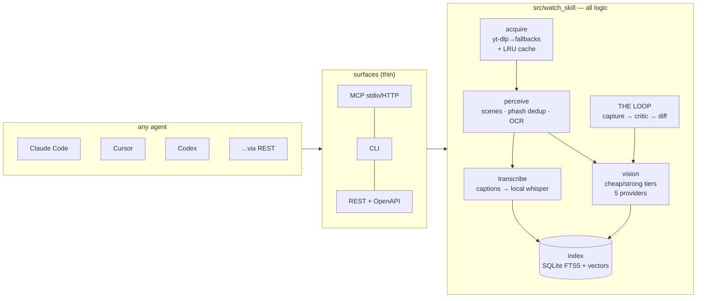

<div align="center">

# Watch Skill

**Give any AI agent the ability to watch video — and to watch its own work and fix it.**

[](https://github.com/oxbshw/watch-skill/actions/workflows/ci.yml)
[](tests/)
[](LICENSE)
[](docs/agents/README.md)
[](pyproject.toml)


*THE LOOP, live: iteration 0 flags `TOTAL: $NaN` as critical with a suggested
fix → the agent fixes the code → iteration 1 verifies FIXED and renders this
GIF. Reproduce: `uv run python "examples/golden_path.py"`.*

</div>

---

## 30-second quickstart

```powershell
# Windows
powershell -ExecutionPolicy Bypass -c "irm https://raw.githubusercontent.com/oxbshw/watch-skill/main/scripts/install.ps1 | iex"
```
```bash
# macOS / Linux (community-verify wanted — written & linted, not yet machine-tested)
curl -fsSL https://raw.githubusercontent.com/oxbshw/watch-skill/main/scripts/install.sh | sh
```

The installer gets uv/Python if missing, bootstraps ffmpeg + yt-dlp + deno
(self-healing `doctor`), and **`watch-skill setup` writes the MCP config into
every agent it finds on your machine** — Claude Code, Claude Desktop, Cursor,
Codex CLI, Windsurf, Gemini CLI — backing up anything it touches.

Then restart your agent and say: *"watch this video: `<any URL>` — what
happens at 0:10?"*

Manual config for your agent (8 agents, honest tested-status matrix):
**[docs/agents/](docs/agents/README.md)**

## What your agent gets

| Tool | What it does |
|------|--------------|
| `watch_video` | Any of 1800+ sites (yt-dlp), direct URLs, HLS/DASH streams, local files → scene-aware deduped frames + OCR + transcript, all **indexed** |
| `ask_video` | Follow-ups answered in **seconds from the index** — no re-processing, across sessions |
| `search_videos` | One query across **every video ever watched** (Arabic and non-Latin scripts included) |
| `get_moment` | Dense frames + transcript + OCR around one timestamp |
| `capture` | Record a URL session (headless browser), the screen, or a window |
| `loop_start` / `loop_iterate` | **THE LOOP**: record own output → structured critique vs your pass criteria → you fix → re-verify → before/after proof |
| `doctor` | Self-heals: installs ffmpeg/yt-dlp/deno, updates stale extractors |

Plus the same operations via **CLI**, **REST + OpenAPI**, and **Python** —
any agent that speaks MCP *or* HTTP works with zero custom code.

## Why this exists (and what it improves on)

Watch Skill began as an attempt to surpass
[claude-video](https://github.com/bradautomates/claude-video) — the skill
that first gave Claude a video input, and the source of several ideas we
kept (token-aware frame budgets, captions-first transcription, focused
mode). Credit where due. What's different:

| | claude-video | Watch Skill |
|---|---|---|
| Sources | curated platform list | anything yt-dlp speaks (1800+), HLS/DASH live, local files, **screen/browser capture** |
| Agents | Claude (skill) | **any MCP agent + CLI + REST/OpenAPI + Python** (8 agents documented, 4 machine-tested) |
| Sampling | uniform/keyframe fps | scene detection + perceptual-hash dedup, budget spent on *distinct* content |
| Memory | re-process per session | **persistent index** — hybrid FTS5+vector retrieval, ask forever, cross-video search |
| Transcription | captions → cloud Whisper API | captions (**original language first**) → **local** faster-whisper (offline default) → opt-in cloud |
| OCR | — | on every kept frame; **per-script models** auto-selected + auto-downloaded (Arabic, Cyrillic, Devanagari, Korean, …) |
| Self-verification | — | **THE LOOP**: capture → critique → fix → re-verify → proof GIF |
| Vision models | Claude | Anthropic / OpenAI / Gemini / OpenRouter / **Ollama (fully local)** |
| Self-healing | prints install commands | doctor installs/updates ffmpeg, yt-dlp, deno; auto-recovers extractor breakage |
| i18n | — | test-gated matrix across 8+ languages: script-aware OCR, CJK + diacritic-folding search, **cross-lingual** retrieval |

## Architecture



Deep dive: [docs/ARCHITECTURE.md](docs/ARCHITECTURE.md) — including "add a
vision provider in ~20 lines" and "add a new Loop type".

## Answers you can trust

`ask_video` never hands you an unverified guess (v0.6):

- **Confidence you can audit** — every answer carries a score built from
  real signals: how decisively the top evidence beats the runner-up, and
  whether transcript, OCR, and scene descriptions independently agree.
- **It looks again before you have to** — below the confidence bar, an
  escalation ladder runs cheapest-first: dense high-res re-sampling around
  candidate moments → 2× zoom-crop re-OCR of on-screen text → a stronger
  vision model shown the exact frames it is about to cite. Everything it
  recovers is written back to the index, permanently.
- **The honest floor** — still not sure? The answer says plainly that the
  video does not clearly show it, with the closest real moments. Citation
  timestamps can only come from indexed evidence; a fabricated one cannot
  survive composition (test-enforced).
- **It learns from its mistakes** — `report_mistake` turns a correction
  into a local lesson (classified, stored in `~/.watch-skill/lessons.db`,
  never uploaded) that injects into future similar questions across every
  agent on your machine. `watch-skill evals run` replays all past mistakes
  and prints the pass-rate — watch it climb.


## Spends tokens like they're yours


- **Text-first answers**: timestamps in prose, zero image tokens unless the
  engine is genuinely unsure (or you ask with `include_frames=true`).
- **Semantic answer cache**: repeat or near-duplicate questions return
  instantly at zero model cost (`cached: true`).
- Every response ends with `~N tokens saved vs raw-frame injection`;
  `watch-skill stats` shows the lifetime meter.
- **Hard budget**: a per-question token ceiling the escalation ladder
  respects — accuracy spends, the ceiling caps, and the answer says when it
  stopped early.

## Works in your language

The i18n matrix is test-gated across Arabic, Chinese, Japanese, Korean,
Russian, Hindi, Spanish, and French — not "should work", *tested*:

- **Transcripts**: original-language captions are preferred over
  auto-translations; the local whisper fallback auto-detects the language.
- **On-screen text**: OCR routes each video to a script-specific model
  (Arabic, Cyrillic, Devanagari, Korean, …) — auto-downloaded on first use;
  Latin scripts, Chinese, and Japanese read out of the box. `watch-skill
  doctor` shows which script models are already cached.
- **Search that actually matches**: Arabic hamza/diacritic folding, CJK
  substring search (`修理` finds `修理自行车的刹车`), Devanagari matras
  survive tokenization, and `video` finds `vidéo`.
- **Ask across languages**: the embedding model is multilingual — ask in
  English about a video whose transcript is Arabic (or vice versa) and
  retrieval still lands on the right moment.

## Local-first, by contract

- The video file **never** leaves the machine (test-enforced).
- Transcription is offline by default (faster-whisper, RAM-aware model pick).
  Cloud STT is opt-in and only ever receives extracted mono audio.
- Point `vision.*` at Ollama (`qwen2.5vl`, `llava`, ...) and the entire
  pipeline — including the Loop critic — runs with **zero cloud calls**.
- No cookies, no logins, keys never logged. Details: [SECURITY.md](SECURITY.md).

## Manual install

```powershell
git clone https://github.com/oxbshw/watch-skill && cd watch-skill
uv sync --extra all          # or: pip install -e ".[all]"
uv run watch-skill doctor     # self-heals dependencies
uv run watch-skill setup      # writes MCP config into your agents (with backups)
```

```powershell
watch-skill watch "https://youtu.be/..." "what happens in this video?"
watch-skill ask <video_id> "when does the demo crash?"
watch-skill search "kubernetes"
watch-skill loop start "http://localhost:3000" "no layout shift; total shows a real price"
watch-skill serve            # MCP stdio   (--http for streamable HTTP)
watch-skill api              # REST on :8748, spec at /openapi.json
```

Configuration is env vars / `.env` with the `WATCHSKILL_` prefix — every
knob documented in [src/watch_skill/config.py](src/watch_skill/config.py).

## Contributing

Start with [CONTRIBUTING.md](CONTRIBUTING.md) and the
[roadmap](ROADMAP.md) — more Loop types and a retrieval benchmark suite are
the highest-leverage areas. Non-obvious engineering decisions (Windows
survival, Arabic search, small-local-model taming) are logged with rationale
in [docs/DECISIONS.md](docs/DECISIONS.md).

## License

MIT. Built on the shoulders of yt-dlp, ffmpeg, PySceneDetect, RapidOCR,
faster-whisper, fastembed, FastMCP, and the claude-video idea.
