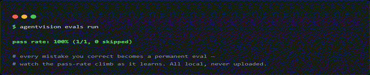
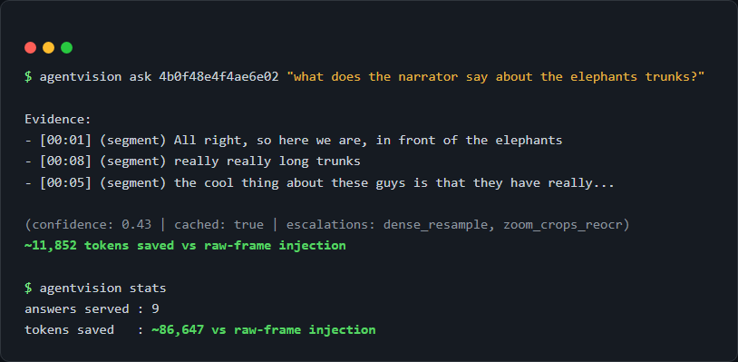
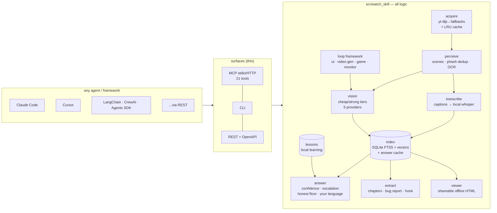

<div align="center">

# Watch Skill

**Give any AI agent the ability to actually watch video.**

Watch Skill turns any video — a URL from 1800+ sites, a live HLS/DASH stream,
a local file, or a recording of the agent's own output — into a persistent,
searchable index of frames, on-screen text, and transcript. Agents ask
questions in seconds, get answers with auditable confidence and timestamp
citations, learn from their own mistakes, and **verify their own visual
output in a loop**. One engine, every surface: MCP (21 tools), CLI, REST,
and native adapters for the major agent frameworks.


*THE LOOP, live: iteration 0 flags `TOTAL: $NaN` as critical with a suggested
fix → the agent fixes the code → iteration 1 verifies FIXED and renders this
GIF. In v0.7 the same loop machinery also runs video-generation, gameplay,
and monitoring loops — and it is proven end-to-end with real vision models.*

[](https://github.com/oxbshw/watch-skill/actions/workflows/ci.yml)
[](LICENSE)
[](pyproject.toml)

</div>

---

## 60-second quickstart

**Claude Code (one command):**

```
/plugin marketplace add oxbshw/watch-skill
/plugin install watch-skill@watch-skill
```

Then run `/watch-skill:setup-watch-skill` once — it installs the engine,
self-heals the binary deps, registers the MCP server in **every** agent on
your machine (Claude Code, Claude Desktop, Cursor, Codex CLI, Windsurf,
Gemini CLI — each with a config backup), and offers a vision backend.

**Everywhere else (one-liner installers):**

```bash
# macOS / Linux
curl -fsSL https://raw.githubusercontent.com/oxbshw/watch-skill/main/scripts/install.sh | sh
```

```powershell
# Windows
powershell -ExecutionPolicy Bypass -c "irm https://raw.githubusercontent.com/oxbshw/watch-skill/main/scripts/install.ps1 | iex"
```

Both bootstrap uv/Python if missing and run the same doctor + multi-agent
setup. Then:

```bash
watch-skill watch "https://youtu.be/..." "what happens in this video?"
watch-skill ask <video_id> "when exactly does the demo crash?"
watch-skill serve            # MCP stdio (--http for streamable HTTP)
```

**Vision is effectively free.** Transcription and search need no key at all
(local Whisper, offline). For scene descriptions and visual Q&A, run
`watch-skill setup-vision --provider gemini --api-key <key>` — Gemini's free
tier (~1,500 requests/day) covers heavy personal use at $0, and the built-in
savings meter keeps token spend honest (~86,647 tokens saved over the first
9 answers on the dev machine). Fully offline instead? `--provider ollama`
picks a local model sized to your RAM.

## Features

- **Watch anything.** 1800+ sites via yt-dlp (self-updating on extractor
  breakage), direct media URLs, HLS/DASH live streams (bounded capture),
  local files, and screen/window/browser recording.
- **Analyze once, ask forever.** A schema-versioned SQLite index (FTS5 +
  local ONNX embeddings, hybrid retrieval) persists across sessions.
  Follow-ups answer in seconds without re-processing; `search_videos` spans
  every video ever watched; `watch_batch` indexes a whole playlist/folder
  into that one memory in a single call.
- **Answers you can trust.** Calibrated confidence from real retrieval
  signals, a cheapest-first escalation ladder, a verify pass where the model
  is shown the exact frames it cites, and an honest "the video does not
  clearly show it" floor. Fabricated timestamps cannot survive composition
  (test-enforced). Answers come back **in the language of your question** —
  refusals included — with RTL-safe timestamps.
- **THE LOOP — now a family.** The agent records its own output, gets a
  structured critique against natural-language pass criteria, fixes the
  code, and re-verifies with a before/after proof GIF. v0.7 makes the runner
  pluggable and adds three loop types no comparable tool has: **video-gen**
  (run Manim/Remotion/any generator, watch the render, iterate until it
  matches the spec), **game** (record real gameplay, catch a NaN score
  counter), and **monitor** (watch a folder/stream until "a demo error
  screen shows", then emit a structured event). Works with real vision even
  on an 8 GB CPU-only machine: the critic automatically degrades from
  strict-JSON to a describe-then-judge mode with deterministic rules.
- **Structured extraction.** `extract_chapters` (titled chapters from scene
  cuts + transcript shifts), `extract_bug_report` (the first on-screen error:
  timestamp, frame, exact OCR text, repro steps), and `analyze_hook` (score
  the first N seconds for creators, with actionable critiques).
- **A shareable viewer.** Every analysis can emit one self-contained HTML
  page — timeline, key frames inlined, transcript, and every answer with the
  exact evidence cited. Zero network requests; open it anywhere, send it to
  anyone.
- **It learns from its mistakes.** `report_mistake` turns a correction into
  a classified lesson (local, never uploaded) injected into future similar
  questions; every mistake becomes a replayable eval.
- **Spends tokens like they're yours.** Text-first answers, a semantic
  answer cache (repeats are free), a per-question budget, and a savings
  meter (`watch-skill stats`).
- **Reads your language — really.** Per-script OCR models auto-selected
  (Arabic, Cyrillic, Devanagari, Korean, Thai, Greek, …). Search that
  works where naive tokenizers break: Thai/Lao/Khmer/Myanmar/Tibetan
  segmentation, Persian/Urdu ↔ Arabic letter unification, cross-script
  digits ("٢٠٢٦" matches "2026"), Hebrew/Greek/Cyrillic/German/Vietnamese
  folding, CJK substring matching, multilingual embeddings.
- **Offline by default.** Captions → local faster-whisper → cloud STT only
  if you opt in. The video file never leaves the machine — enforced by
  tests, not policy. Point vision at Ollama and the entire pipeline runs
  with zero cloud calls.
- **Frame budgets that respect your context window.** Scene detection +
  perceptual-hash dedup spend the budget on *distinct* content; dense
  focused mode for `--start/--end` windows.
- **Fast where it counts.** Cold CLI start ~1.2 s; a full 10-second watch in
  ~33 s warm on an 8 GB no-GPU machine; servers keep models resident.





## Works with your agent — and your framework

Statuses are honestly graded — **machine-tested ✅** (full end-to-end run),
**machine-configured ◐** (config written + MCP initialize answered on a real
machine), **doc-verified ☑** (matches official docs, not executed here).

| Agent | Surface | Status |
|-------|---------|--------|
| [Claude Code](docs/agents/claude-code.md) | MCP (stdio) + plugin marketplace | machine-tested ✅ |
| [Claude Desktop](docs/agents/claude-desktop.md) | MCP (stdio) | machine-configured ◐ |
| [Cursor](docs/agents/cursor.md) | MCP (stdio) | machine-configured ◐ |
| [Codex CLI](docs/agents/codex-cli.md) | MCP (stdio) | machine-configured ◐ |
| [Cline](docs/agents/cline.md) | MCP (stdio) | doc-verified ☑ |
| [Windsurf](docs/agents/windsurf.md) | MCP (stdio) | doc-verified ☑ |
| [Gemini CLI](docs/agents/gemini-cli.md) | MCP (stdio) | doc-verified ☑ |
| [VS Code (Copilot agent)](docs/agents/vscode.md) | MCP (stdio) | doc-verified ☑ |
| Claude Code / claude.ai skills | [`watch-skill.skill` bundle](adapters/claude-skill/) | machine-tested ✅ |
| **LangChain / LangGraph** | [native tools](docs/agents/frameworks.md) (`pip install "watch-skill[langchain]"`) | machine-tested ✅ |
| **CrewAI** | [native tools](docs/agents/frameworks.md) | machine-tested ✅ |
| **OpenAI Agents SDK** | [native tools](docs/agents/frameworks.md) | machine-tested ✅ |
| LlamaIndex | [native tools](docs/agents/frameworks.md) | unit-tested ◐ |
| AutoGen (v0.4+) | [native tools](docs/agents/frameworks.md) | unit-tested ◐ |
| Vercel AI SDK | [REST recipe](docs/agents/frameworks.md) | doc-verified ☑ |
| n8n | [HTTP node + community-node spec](docs/agents/frameworks.md) | doc-verified ☑ |
| Anything with HTTP | REST + OpenAPI (`watch-skill api`) | machine-tested ✅ |

Full matrix with per-agent install, config, and smoke tests:
[docs/agents/README.md](docs/agents/README.md).

## Examples

| Example | What it shows |
|---------|---------------|
| [01-watch-and-ask](examples/01-watch-and-ask) | Watch a URL, ask follow-ups from the index — the core loop |
| [02-focused-moment](examples/02-focused-moment) | Dense sampling of a `--start/--end` window, `get_moment` around a timestamp |
| [03-cross-video-search](examples/03-cross-video-search) | One query across every video ever watched |
| [04-ui-loop](examples/04-ui-loop) | THE LOOP: capture your own UI → critique → fix → re-verify with proof |
| [05-multilingual-arabic](examples/05-multilingual-arabic) | Arabic in, Arabic out: script-aware OCR, folded search, cross-lingual ask |
| [06-agent-integration](examples/06-agent-integration) | Wiring the MCP server / REST API into an agent |
| [07-lessons-and-stats](examples/07-lessons-and-stats) | report_mistake → lesson → replayable eval; the savings meter |
| [08-loop-types](examples/08-loop-types) | Video-gen, game, and monitor loops — each run live with a real vision critic |
| [09-framework-adapters](examples/09-framework-adapters) | Real watch+ask through LangChain, CrewAI, and the OpenAI Agents SDK |
| [10-structured-extraction](examples/10-structured-extraction) | Chapters, bug report, and hook analysis on one clip |
| [11-batch-mode](examples/11-batch-mode) | Index a small library in one call, answer a cross-video question |

## Architecture

Thin surfaces, one core. `src/watch_skill` holds all logic; MCP, CLI, REST,
and the framework adapters are wrappers that never diverge.



Deep dive: [docs/architecture.md](docs/architecture.md) — including "add a
vision provider in ~20 lines" and "add a new Loop type" (a producer function
+ a registry entry).

## What makes it different

Watch Skill began as an attempt to surpass
[claude-video](https://github.com/bradautomates/claude-video) — the skill
that first gave Claude a video input, and the source of ideas we kept
(token-aware frame budgets, captions-first transcription, focused mode).
The strongest of the newer wave is
[claude-video-vision](https://github.com/jordanrendric/claude-video-vision),
which nailed the install story — two `/plugin` commands and a setup wizard
that finds ffmpeg for you — and describes itself, accurately, as "a
perception layer, not an interpretation layer". Credit where due on both
counts: claude-video is simpler for Claude-only workflows, and
claude-video-vision is the smoothest way to put frames in front of Claude
today. Watch Skill is the layer they both stop short of: what was seen gets
indexed, stays searchable across videos and sessions, and feeds back into
better answers. What's different:

| | claude-video | claude-video-vision | Watch Skill |
|---|---|---|---|
| Core idea | frames into context | frames + timestamped audio into context | **interpret + remember + self-improve** |
| Platforms | where Claude runs | macOS-tested (needs Node 20+) | Windows + Linux + macOS |
| Install | plugin | two `/plugin` commands + setup wizard | one command (`/plugin marketplace add oxbshw/watch-skill` or a shell one-liner) |
| Memory | re-process per session | opt-in `enable_index`; sessions expire (7-day default) | persistent index on by default — hybrid FTS5+vector retrieval, ask forever, cross-video search, `watch_batch` for whole playlists |
| Free vision path | — (Claude reads frames) | — (Claude reads frames); free-tier Gemini for audio | Gemini free tier **or fully-offline Ollama** (RAM-aware model pick) + a token-savings meter (~86,647 tokens saved / 9 answers measured) |
| Answer integrity | model prose | model prose | calibrated confidence, escalation ladder, verify pass, honest refusal floor; fabricated timestamps test-blocked |
| Self-verification | — | — | THE LOOP with proof GIFs — plus video-gen, game, and monitor loop types |
| Learning | — | — | mistake reports → local lessons → replayable evals |
| Structured outputs | — | — | chapters, bug reports, hook analysis, shareable offline viewer |
| Agents | Claude (skill) | Claude Code (plugin) | any MCP agent + CLI + REST/OpenAPI + LangChain/CrewAI/Agents-SDK/LlamaIndex/AutoGen adapters |
| Languages | — | model-dependent | per-script OCR + normalization for 20+ scripts, cross-lingual ask, answers in the question's language — test-gated |
| Sampling | uniform/keyframe fps | adaptive extraction (Claude picks fps/range) | scene detection + perceptual-hash dedup; budget on distinct content |
| Dependency healing | prints install commands | setup wizard auto-detects ffmpeg | `doctor` installs/updates ffmpeg, yt-dlp; auto-recovers extractor breakage |

## Docs

- [Getting started](docs/getting-started.md)
- [Configuration](docs/configuration.md) — every knob is an env var / `.env`
  entry with the `WATCHSKILL_` prefix
- [Tool reference](docs/tools/) — all 21 MCP tools with schemas
- [Framework adapters](docs/agents/frameworks.md) — LangChain, CrewAI,
  Agents SDK, LlamaIndex, AutoGen, Vercel AI SDK, n8n
- [Guides](docs/guides/) — loops, lessons, capture, multilingual
- [Architecture](docs/architecture.md)
- [Troubleshooting](docs/troubleshooting.md)
- [Agent matrix](docs/agents/README.md)
- [Engineering decision log](docs/DECISIONS.md) — the non-obvious choices,
  with numbers

Prefer a manual install?

```bash
git clone https://github.com/oxbshw/watch-skill && cd watch-skill
uv sync --extra all          # or: pip install -e ".[all]"
uv run watch-skill doctor    # self-heals dependencies
uv run watch-skill setup     # writes MCP config into your agents (with backups)
```

## Roadmap

Highlights from [docs/ROADMAP.md](docs/ROADMAP.md) (v0.8):

- **Language-coverage benchmark** — per-language OCR char-hit / WER / search
  recall / cross-lingual retrieval, published as proof; paired with an
  opt-in bge-m3 embedding upgrade.
- **Webhook/event system** — the monitor loop's events delivered anywhere
  (n8n/Zapier trigger nodes).
- **A/B hook comparison and visual diff between two videos** — regression
  monitoring for video.

## Contributing, security, license

- [CONTRIBUTING.md](CONTRIBUTING.md) — dev setup, the offline test suite,
  what makes a PR land.
- [SECURITY.md](SECURITY.md) — privacy invariants (no cookies, no logins,
  the video file never leaves the machine) and how to report issues.
- MIT — see [LICENSE](LICENSE). Built on the shoulders of yt-dlp, ffmpeg,
  PySceneDetect, RapidOCR, faster-whisper, fastembed, FastMCP, and the
  claude-video idea.
