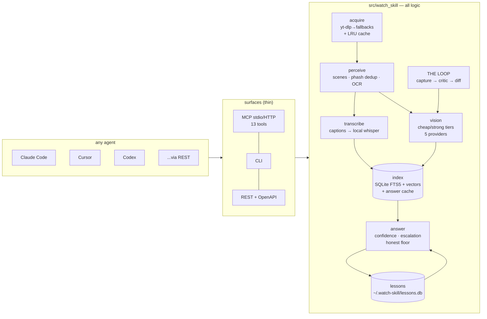

<div align="center">

# Watch Skill

**Give any AI agent the ability to actually watch video.**

Watch Skill turns any video — a URL from 1800+ sites, a live HLS/DASH stream,
a local file, or a recording of the agent's own output — into a persistent,
searchable index of frames, on-screen text, and transcript. Agents ask
questions in seconds, get answers with auditable confidence and timestamp
citations, and learn from their own mistakes. One engine, three surfaces:
MCP (13 tools), CLI, and REST.


*THE LOOP, live: iteration 0 flags `TOTAL: $NaN` as critical with a suggested
fix → the agent fixes the code → iteration 1 verifies FIXED and renders this
GIF.*

[](https://github.com/oxbshw/watch-skill/actions/workflows/ci.yml)
[](LICENSE)
[](pyproject.toml)

</div>

---

## 60-second quickstart

```bash
# macOS / Linux
curl -fsSL https://raw.githubusercontent.com/oxbshw/watch-skill/main/scripts/install.sh | sh
```

```powershell
# Windows
powershell -ExecutionPolicy Bypass -c "irm https://raw.githubusercontent.com/oxbshw/watch-skill/main/scripts/install.ps1 | iex"
```

The installer bootstraps uv/Python if missing, self-heals the binary deps
(ffmpeg, yt-dlp, deno via `watch-skill doctor`), and `watch-skill setup`
writes the MCP config into every agent it finds — Claude Code, Claude
Desktop, Cursor, Codex CLI, Windsurf, Gemini CLI — backing up anything it
touches. Then:

```bash
watch-skill watch "https://youtu.be/..." "what happens in this video?"
watch-skill ask <video_id> "when exactly does the demo crash?"
watch-skill serve            # MCP stdio (--http for streamable HTTP)
```

Or skip the CLI entirely: restart your agent and say *"watch this video:
`<any URL>` — what happens at 0:10?"*. Manual per-agent config lives in
[docs/agents/](docs/agents/README.md).

## Features

- **Watch anything.** 1800+ sites via yt-dlp (self-updating on extractor
  breakage), direct media URLs, HLS/DASH live streams (bounded capture),
  local files, and screen/window/browser recording.
- **Frame budgets that respect your context window.** Scene detection +
  perceptual-hash dedup spend the budget on *distinct* content: 512 px
  frames, hard cap of 100 per video, ≤2 fps, duration-tiered — with a dense
  focused mode for `--start/--end` windows.
- **Offline by default.** Platform captions (original language preferred
  over auto-translations) → local faster-whisper with RAM-aware model
  selection → cloud STT only if you opt in. The video file never leaves the
  machine — enforced by tests, not policy. Point vision at Ollama and the
  entire pipeline runs with zero cloud calls.
- **Analyze once, ask forever.** A schema-versioned SQLite index (FTS5 +
  local ONNX embeddings, hybrid retrieval) persists across sessions.
  Follow-ups answer in seconds without re-processing; `search_videos` spans
  every video ever watched. Vector scoring is numpy-batched: 122 ms over
  10k×384 vectors vs 5.46 s pure-Python (45×).
- **Answers you can trust (v0.6).** Every answer carries a calibrated
  confidence score built from real retrieval signals (top-hit strength,
  margin over the runner-up, cross-kind evidence agreement, lexical
  anchoring). Below the bar, an escalation ladder runs cheapest-first —
  dense re-sampling → 2× zoom-crop re-OCR → a verify pass where the model
  is shown the exact frames it is about to cite. Still unsure? The honest
  floor says so plainly, with the closest real moments. Fabricated
  timestamps cannot survive composition (test-enforced).
- **It learns from its mistakes (v0.6).** `report_mistake` turns a
  correction into a classified lesson in `~/.watch-skill/lessons.db` —
  local, never uploaded — injected into future similar questions across
  every agent on the machine. Every mistake becomes a replayable eval:
  `watch-skill evals run` reports the pass-rate over time.
- **Spends tokens like they're yours (v0.6).** Text-first answers (zero
  image tokens unless genuinely uncertain), a semantic answer cache
  (repeats are free, marked `cached: true`), a per-question token budget
  the ladder respects, and a savings meter. On this machine, 9 answers
  served ≈ 86,647 tokens saved vs raw-frame injection (`watch-skill stats`).
- **Reads your language.** Per-script OCR models auto-selected and
  auto-downloaded (Arabic, Cyrillic, Devanagari, Korean, …; benchmarked
  per script — Arabic at 100% char-hit on the bench render), Arabic
  hamza/diacritic-folded search, CJK substring matching, and a multilingual
  embedding model — ask in English about an Arabic transcript (en→ar 0.58
  vs ~0.0 for distractors) and retrieval still lands.
- **THE LOOP.** The agent records its own output (browser, screen, window),
  gets a structured critique against natural-language pass criteria, fixes
  the code, and re-verifies — with a before/after proof GIF.
- **Fast where it counts.** Cold CLI start ~1.2 s; a full 10-second watch
  (scenes + frames + OCR + local whisper) in 32.9 s warm on an 8 GB-RAM,
  no-GPU machine; MCP/REST servers keep models resident so agent follow-ups
  skip load time. 284 tests, offline.


## Works with your agent

Statuses are honestly graded — **machine-tested ✅** (full end-to-end run in
the agent), **machine-configured ◐** (`watch-skill setup` wrote the config
on a real machine and the server answered an MCP `initialize`; no in-app
chat run), **doc-verified ☑** (matches the agent's official docs, not
executed here).

| Agent | Surface | Status |
|-------|---------|--------|
| [Claude Code](docs/agents/claude-code.md) | MCP (stdio) | machine-tested ✅ |
| [Claude Desktop](docs/agents/claude-desktop.md) | MCP (stdio) | machine-configured ◐ |
| [Cursor](docs/agents/cursor.md) | MCP (stdio) | machine-configured ◐ |
| [Codex CLI](docs/agents/codex-cli.md) | MCP (stdio) | machine-configured ◐ |
| [Cline](docs/agents/cline.md) | MCP (stdio) | doc-verified ☑ |
| [Windsurf](docs/agents/windsurf.md) | MCP (stdio) | doc-verified ☑ |
| [Gemini CLI](docs/agents/gemini-cli.md) | MCP (stdio) | doc-verified ☑ |
| [VS Code (Copilot agent)](docs/agents/vscode.md) | MCP (stdio) | doc-verified ☑ |
| Claude Code / claude.ai skills | [`watch-skill.skill` bundle](adapters/claude-skill/) | machine-tested ✅ |
| Anything with HTTP | REST + OpenAPI (`watch-skill api`) | machine-tested ✅ |
| Any MCP client (remote) | MCP streamable HTTP (`watch-skill serve --http`) | machine-tested ✅ |

Full matrix with per-agent install, config, and 3-step smoke tests:
[docs/agents/README.md](docs/agents/README.md). An
[AGENTS.md adapter](adapters/agents-md/AGENTS.md) covers agents that read
repo-level instructions.

## Examples

| Example | What it shows |
|---------|---------------|
| [01-watch-and-ask](examples/01-watch-and-ask) | Watch a URL, ask follow-ups from the index — the core loop |
| [02-focused-moment](examples/02-focused-moment) | Dense sampling of a `--start/--end` window, `get_moment` around a timestamp |
| [03-cross-video-search](examples/03-cross-video-search) | One query across every video ever watched |
| [04-ui-loop](examples/04-ui-loop) | THE LOOP: capture your own UI → critique → fix → re-verify with proof |
| [05-multilingual-arabic](examples/05-multilingual-arabic) | Arabic in, Arabic out: script-aware OCR, folded search, cross-lingual ask |
| [06-agent-integration](examples/06-agent-integration) | Wiring the MCP server / REST API into an agent |
| [07-lessons-and-stats](examples/07-lessons-and-stats) | report_mistake → lesson → replayable eval; the savings meter |

## Architecture

Thin surfaces, one core. `src/watch_skill` holds all logic; MCP, CLI, and
REST are wrappers that never diverge.



Deep dive: [docs/architecture.md](docs/architecture.md) — including "add a
vision provider in ~20 lines" and "add a new Loop type".

## How it compares to claude-video

Watch Skill began as an attempt to surpass
[claude-video](https://github.com/bradautomates/claude-video) — the skill
that first gave Claude a video input, and the source of ideas we kept
(token-aware frame budgets, captions-first transcription, focused mode).
Credit where due: it is simpler to adopt for Claude-only workflows and has
no engine to install. What's different:

| | claude-video | Watch Skill |
|---|---|---|
| Sources | curated platform list | anything yt-dlp speaks (1800+), HLS/DASH live, local files, screen/browser capture |
| Agents | Claude (skill) | any MCP agent + CLI + REST/OpenAPI + Python (11 integrations documented, machine-tested vs doc-verified honestly labeled) |
| Sampling | uniform/keyframe fps | scene detection + perceptual-hash dedup; budget spent on distinct content |
| Memory | re-process per session | persistent index — hybrid FTS5+vector retrieval, ask forever, cross-video search |
| Offline capability | captions → cloud Whisper API | offline by default: local faster-whisper, local ONNX embeddings/OCR, optional Ollama vision — zero-cloud pipeline possible |
| i18n / Arabic-in-Arabic-out | — | original-language captions preferred, per-script OCR models, Arabic-folded + CJK search, cross-lingual retrieval — test-gated across 8 languages |
| Self-healing answers | — | calibrated confidence + escalation ladder + verify pass + honest "the video does not clearly show it" floor; `report_mistake` lessons replayed as evals |
| Token savings / answer cache | frame injection per question | text-first answers, semantic answer cache (repeats free), per-question budget, savings meter (~86,647 tokens saved over 9 answers on the dev machine) |
| Self-verification | — | THE LOOP: capture → critique → fix → re-verify → proof GIF |
| Dependency healing | prints install commands | `doctor` installs/updates ffmpeg, yt-dlp, deno; auto-recovers extractor breakage |

## Docs

- [Getting started](docs/getting-started.md)
- [Configuration](docs/configuration.md) — every knob is an env var / `.env`
  entry with the `WATCHSKILL_` prefix
- [Tool reference](docs/tools/) — all 13 MCP tools with schemas
- [Guides](docs/guides/) — loops, lessons, capture, multilingual
- [Architecture](docs/architecture.md)
- [Troubleshooting](docs/troubleshooting.md)
- [Agent matrix](docs/agents/README.md)
- [Engineering decision log](docs/DECISIONS.md) — the non-obvious choices,
  with numbers

Prefer a manual install?

```bash
git clone https://github.com/oxbshw/watch-skill && cd watch-skill
uv sync --extra all          # or: pip install -e ".[all]"
uv run watch-skill doctor    # self-heals dependencies
uv run watch-skill setup     # writes MCP config into your agents (with backups)
```

## Roadmap

Highlights from [docs/ROADMAP.md](docs/ROADMAP.md):

- **More Loop types** — game capture, video-generation, long-running visual
  monitors; the runner/critic/diff machinery is already generic.
- **Benchmark suite** — scored (video, question, expected-evidence) triples
  for retrieval quality and frame-budget efficiency; the highest-leverage
  contribution for quality work.
- **sqlite-vec ANN index** — the numpy batch handles 10k vectors in ~120 ms;
  past ~100k segments a real ANN index pays off.
- **Word-level timestamps** — faster-whisper supports them; plumb through so
  `get_moment` can cite exact words.

## Contributing, security, license

- [CONTRIBUTING.md](CONTRIBUTING.md) — dev setup, test suite (284 offline
  tests), what makes a PR land.
- [SECURITY.md](SECURITY.md) — privacy invariants (no cookies, no logins,
  the video file never leaves the machine) and how to report issues.
- MIT — see [LICENSE](LICENSE). Built on the shoulders of yt-dlp, ffmpeg,
  PySceneDetect, RapidOCR, faster-whisper, fastembed, FastMCP, and the
  claude-video idea.
