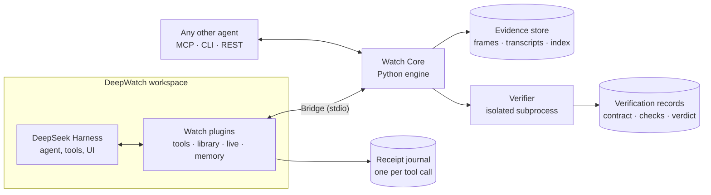

<!-- mcp-name: io.github.oxbshw/watch-skill -->
<div align="center">


### Watch Skill · DeepWatch

**Give an agent eyes and ears — and a record of its work that something
other than the agent wrote.**

[](https://github.com/oxbshw/watch-skill/actions/workflows/ci.yml)
[](https://github.com/oxbshw/watch-skill/actions/workflows/workspace-ci.yml)
[](https://pypi.org/project/watch-skill/)
[](LICENSE)

</div>

---

## Two things, and how they fit

**Watch Skill** is the engine. It turns video, audio and screen activity into
searchable, **timestamped evidence**, and it runs deterministic verification
contracts whose verdicts do not come from a language model. Any agent can use
it — through MCP, a CLI, or a REST API.


**DeepWatch** is the workspace. It composes the official
[DeepSeek Harness](https://github.com/deepseek-ai/deepseek-harness) with Watch
Skill so an agent's work happens *inside* something that watches it: every tool
call gets a receipt, every path a tool **declares** is checked against one
workspace boundary, and "it worked" is a claim you can open.

The word *declares* is load-bearing. A `write` names the file it is writing and
that name is checked before the call runs. A shell command is a string this
does not parse, so what is enforced there is the sandbox the Harness itself
runs the shell under, and what is recorded is that a shell call happened with
no path of its own. Both are in the receipt; they are not the same guarantee,
and reading them as one is the mistake this paragraph exists to prevent.

One sentence each: **Watch Skill is what sees and proves. DeepWatch is where
the work happens.** You can use either on its own.

---

## What it actually looks like

<div align="center">

</div>

An ordinary request — *create `totals.json` and tell me the sum*. Nobody
mentioned Watch. Every row is a receipt, every path is workspace-relative, and
the total was read back from the file rather than remembered.

Then the part that matters:

<div align="center">

</div>

`watch_verify` ran a frozen contract and **Watch Core** answered. The agent did
not grade itself: a check either passed or it did not, the contract's digest is
on screen, and the same contract run from a different directory fails.

Every image here is a photograph of a room built only from sealed artifacts,
with a provider bound and Watch Core running over stdio. Nothing is seeded or
retouched. Each caption on
[the screenshot page](workspace/docs/screenshots-release.md) names the build it
was taken from, because more than one candidate was photographed on the way
here and saying "this release" of all of them would not have been true.

---

## Start here

### I have an agent already → Watch Skill

> **On PyPI, one version behind.** `watch-skill` is published and installs
> today; the newest release on PyPI is 1.2.0. The 1.4.0 this page describes is
> published by the `core-v1.4.0` release.

```bash
pip install 'watch-skill[standard]'   # frames, retrieval and the MCP server
watch-skill doctor                    # checks, and repairs what it can
watch-skill watch <video-url-or-file>
watch-skill ask <id> "what changed at 3:12?"
```

**Take the extra seriously.** A bare `pip install watch-skill` gives you the
CLI, the verifier and the Bridge, and it cannot extract a frame: `watch` stops
at `perceive.missing_dependency` on the first video. `[standard]` is frames,
retrieval and MCP; add `[ocr]` to read on-screen text, `[whisper]` for local
transcription when a source has no captions, `[loop]` for the browser, or take
`[all]`. `watch-skill doctor` names the exact command for whatever is missing.

Wire it into any MCP client (`[standard]` includes this):

```bash
watch-skill serve              # stdio MCP server, 39 tools
```

Or install the skills into 25+ agents at once — Claude Code, Cursor, Codex,
Copilot, Gemini CLI, Cline, Zed and more:

```bash
npx skills add oxbshw/watch-skill -g
```

Per-client setup: **[docs/agents/](docs/agents/README.md)**.

### I want the workspace → DeepWatch

> **Not on npm yet.** Nothing exists under the `@deepwatch` scope until the
> `deepwatch-v0.1.0` release publishes it. Until then the command below
> resolves nothing, and
> [getting started](workspace/docs/getting-started.md) has the path that works
> from a checkout.

```bash
npm install -g @deepwatch/cli   # pending the deepwatch-v0.1.0 release
deepwatch setup                 # builds the runtime and composes the profile
deepwatch web --workspace ./my-project
```

`deepwatch doctor` reports what is installed and what is missing; `deepwatch
setup` is what builds things, and it asks before downloading anything.

Node ≥ 22.19 and Python 3.11, 3.12 or 3.13 — the versions CI runs and the
classifiers declare. Windows, macOS and Linux.

---

## THE LOOP: observe, act, verify

The cycle in the picture at the top, on a real page:

```bash
pip install 'watch-skill[standard,loop]' && playwright install chromium

watch-skill loop start http://localhost:3000/checkout \
  "the total updates when quantity changes, and no NaN appears"
```

1. **Observe** — a real browser records the page to video; frames are extracted
   and OCR'd, each with an absolute timestamp.
2. **Critique** — a vision model is asked whether the capture meets the
   criteria you wrote. It reports issues with the timestamp each was seen at.
3. **Fix** — you change the code.
4. **Verify** — `watch-skill loop iterate` re-captures and diffs against the
   previous run, so "fixed" means the thing that was wrong is gone.

The critique step needs a vision-capable model. Without one, capture, frames,
OCR and verification still work and the critique says it cannot judge rather
than guessing. See [THE LOOP](docs/guides/the-loop.md).

---

## What people use it for

| | |
| --- | --- |
| **Ask a video a question** | Index a recording once, then ask about it. Answers cite timestamps you can open. [`01-watch-and-ask`](examples/01-watch-and-ask) |
| **Prove an agent's work** | A deterministic contract Core runs — file digests, JSON values, SQL, HTTP, DOM. [`14-browser-verification`](examples/14-browser-verification) |
| **Fix a UI by looking at it** | Capture, critique, fix, re-verify. [`04-ui-loop`](examples/04-ui-loop) |
| **Search across everything** | One index over every source you have watched. [`03-cross-video-search`](examples/03-cross-video-search) |
| **Work offline** | Local whisper and OCR, no provider, nothing leaves the machine. [`15-private-offline-workflow`](examples/15-private-offline-workflow) |
| **Watch something live** | A stream or a browser session, bounded and cursored. [`18-live-watch`](examples/18-live-watch) |

Each one is a directory you can run, with its prerequisites and expected
output written next to it.

| | |
| --- | --- |
| Learn the core | [01 Watch and ask](examples/01-watch-and-ask) · [02 Focused moment](examples/02-focused-moment) · [03 Cross-video search](examples/03-cross-video-search) |
| Build with agents | [06 MCP and REST](examples/06-agent-integration) · [09 Framework adapters](examples/09-framework-adapters) · [15 Private offline workflow](examples/15-private-offline-workflow) |
| Understand and organise | [05 Multilingual Arabic](examples/05-multilingual-arabic) · [10 Structured extraction](examples/10-structured-extraction) · [11 Batch mode](examples/11-batch-mode) · [12 Library memory](examples/12-library-memory) · [16 Shareable viewer](examples/16-shareable-viewer) |
| Verify and improve | [04 UI loop](examples/04-ui-loop) · [07 Lessons and stats](examples/07-lessons-and-stats) · [08 Loop types](examples/08-loop-types) · [13 Self-improvement](examples/13-self-improvement) · [14 Browser verification](examples/14-browser-verification) · [17 Freshness and offline](examples/17-freshness-and-offline) · [20 Observer loop](examples/20-observer-loop) |
| Watch live | [18 Live watch](examples/18-live-watch) · [19 Live browser](examples/19-live-browser) |

That is all 20 examples; the index is **[examples/](examples/README.md)**.

---

## How it fits together


```mermaid
flowchart LR
  subgraph W["DeepWatch workspace"]
    H["DeepSeek Harness<br/>agent, tools, UI"]
    P["Watch plugins<br/>tools · library · live · memory"]
    H <--> P
  end
  P <-->|"Bridge (stdio)"| C["Watch Core<br/>Python engine"]
  C --> E[("Evidence store<br/>frames · transcripts · index")]
  C --> V["Verifier<br/>isolated subprocess"]
  V --> R[("Verification records<br/>contract · checks · verdict")]
  P --> J[("Receipt journal<br/>one per tool call")]
  A["Any other agent<br/>MCP · CLI · REST"] <--> C
```

Watch Core is the only thing that issues a verdict. The Host may notice,
correlate, freeze a contract and ask — it may not decide the answer. That is
[ADR-002](workspace/docs/adr/), and a build gate fails if anything under
`packages/` starts producing verdicts.

More: [architecture](docs/architecture.md) · [verification](docs/verification.md).

---

## What works, and what it needs

| Capability | Out of the box | Needs |
| --- | --- | --- |
| Start the app, browse, read diagnostics | ✅ | nothing |
| Verification contracts, containment, receipts | ✅ | nothing |
| Video frames and scenes | with `[standard]` | `ffmpeg` ≥ 5.1 — `watch-skill doctor` installs it |
| Reading on-screen text | with `[ocr]` | a first-use model download (~80 MB) |
| Speech to text | with `[whisper]` | a first-use model download; captions are used first when a source has them |
| Chat with an agent | — | a provider you add and bind |
| Visual scene description | — | a model that can see images |
| Browser capture / THE LOOP | with `[loop]` | `playwright install chromium` |
| Memory | off | enable in Settings; the store is plaintext and says so |
| Desktop app | not distributed | run the web workspace |

**On providers, and three things that are not the same.**

DeepWatch starts, and stays useful, with no provider configured: verification,
containment, the Library and local perception are all local. What needs a
provider is the *agent* — chat, tool use, and the critique step of THE LOOP.

The three ways a capability gets added here are genuinely different, and the
product does not pretend otherwise.

- **A local dependency** — `ffmpeg`, a JS runtime, `yt-dlp` — runs on your
  machine, costs disk, and `watch-skill doctor` will fetch and repair it.
- **A downloaded model** — OCR weights, whisper — also runs on your machine, is
  a large one-time download, and is slower and less capable than a hosted model
  of the same kind. Nothing about your files leaves the machine.
- **A hosted provider** — the agent's model, and any vision model you bind — is
  somebody else's service, with their latency, their price and their terms, and
  it sees what you send it.

An OpenAI-compatible server you run yourself (Ollama, vLLM, LM Studio,
llama.cpp) is a hosted route pointed at your own hardware: it keeps the data
local and keeps the caveat, because a small local model may not support tool
calls or images at all, and DeepWatch will report that rather than work around
it. Nothing reaches a provider until you add one, and holding a provider
credential is not permission to upload a frame or a transcript — that is a
separate consent.

**What repairs itself, and what does not.** `watch-skill doctor` repairs
dependencies: it downloads `yt-dlp` and keeps it current, bootstraps a JS
runtime, installs OCR language data, and fetches `ffmpeg` where it can. That is
deliberate and it is the only thing here that fixes itself. Nothing resumes a
task on its own, nothing learns between runs, and nothing is encrypted at rest
in this release. [Known limitations](workspace/docs/known-limitations.md) is
the full list.

---

## Measured, not asserted

Against a leading video-understanding API, same files, same scorer:

| | Watch Skill | Baseline |
| --- | --- | --- |
| Written-analysis groundedness | **89.7%** | 27.9% |
| Citations per 100 words | **13.23** | 0.12 |
| Frame delivery on real footage | **96.9%** | 31.2% |
| Cue starts within half a second | **100%** | 25% |

Method and fixtures: [benchmarks/video_backends/](benchmarks/video_backends/README.md).

---

## Documentation

| | |
| --- | --- |
| [Getting started](docs/getting-started.md) | Install, first watch, first agent connection |
| [Install and upgrade](workspace/docs/install-and-upgrade.md) | Both products, optional extras, compatibility policy |
| [Tool reference](docs/tools/README.md) | All 39 MCP tools and their REST/CLI counterparts |
| [Verification](docs/verification.md) | Contracts, the fourteen check types, assurance levels |
| [Architecture](docs/architecture.md) | Boundaries, data flow, extension points |
| [Agent matrix](docs/agents/README.md) | Per-client setup and how far each is verified |
| [Troubleshooting](docs/troubleshooting.md) | Dependency repair and common runtime errors |
| [Comparison](docs/comparison.md) | Honest trade-offs against the alternatives |
| [Ecosystem](docs/ecosystem.md) | Where this project appears, and which of it is coverage |
| [Known limitations](workspace/docs/known-limitations.md) | What this release does not do |
| **DeepWatch** | [workspace README](workspace/README.md) · [setup](workspace/docs/setup.md) · [releasing](workspace/docs/releasing.md) |

Three tool counts, because they answer different questions: **39** MCP tools
from `watch-skill serve`, **22** `watch_*` tools added to an agent inside
DeepWatch, **47** tools that agent is offered in total.

---

## Contributing

Issues and pull requests welcome — [CONTRIBUTING.md](CONTRIBUTING.md) has the
twenty-minute path. Security policy: [SECURITY.md](SECURITY.md).

<div align="center">

Built on DeepSeek Harness · Powered by Watch Skill. An independent project,
not affiliated with or endorsed by DeepSeek.

</div>
