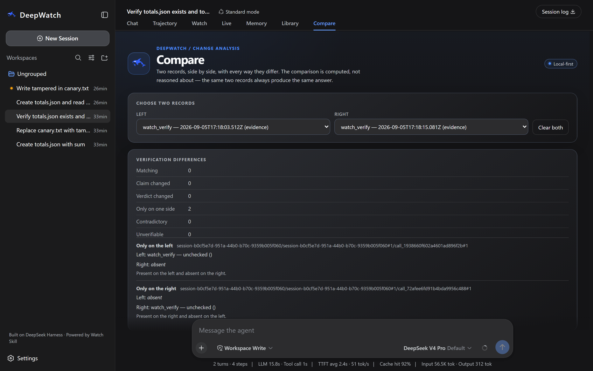
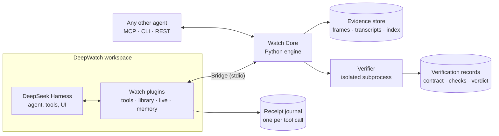

<!-- mcp-name: io.github.oxbshw/watch-skill -->
<div align="center">


# Watch Skill · DeepWatch

**Give AI agents eyes, ears, and verifiable results.**

**Watch Skill** turns video, audio and screen activity into searchable,
timestamped evidence, and answers *did that actually work?* with a
deterministic contract rather than a model's opinion. Add it to the agent you
already use over MCP.

**DeepWatch** is a ready-made agent workspace — the official DeepSeek Harness
with Watch Skill already composed in — where a tool call leaves a receipt you
can open, and a result can be checked by something other than the agent that
produced it.

**Python · PyPI**

[](https://pypi.org/project/watch-skill/)
[](https://pypistats.org/packages/watch-skill)
[](https://pypi.org/project/watch-skill/)

**Node · npm**

[](https://www.npmjs.com/package/@deepwatch/cli)
[](https://www.npmjs.com/package/@deepwatch/dsh-bundle)
[](https://www.npmjs.com/package/@deepwatch/cli)
[](workspace/docs/install-and-upgrade.md)
[](https://github.com/oxbshw/watch-skill/releases?q=deepwatch)

**Gates and directories**

[](https://github.com/oxbshw/watch-skill/actions/workflows/ci.yml)
[](https://github.com/oxbshw/watch-skill/actions/workflows/workspace-ci.yml)
[](https://github.com/oxbshw/watch-skill/actions/workflows/install.yml)
[](https://www.skills.sh/oxbshw/watch-skill/watch)
[](docs/agents/README.md)
[](LICENSE)

[Install](#start-here) ·
[Use it](#the-deepwatch-workspace) ·
[THE LOOP](#the-loop-observe-act-verify) ·
[Packages](#which-package-is-for-you) ·
[Architecture](#how-it-fits-together) ·
[Docs](#documentation) ·
[Community](#community--ecosystem)

</div>

---

## Two capabilities, and they work apart

**Perception.** Video, audio and screen activity become frames, transcripts and
OCR text, each carrying an absolute timestamp. Index a source once and query it
for as long as you keep it; every answer cites a moment you can open.

**Verification.** A frozen contract — file digests, JSON values, SQL results,
HTTP responses, DOM state — is evaluated by a separate process. The verdict is
`VERIFIED`, `FAILED`, `UNVERIFIED` or `INCONCLUSIVE`, and it does not come from
a language model.

Either is useful on its own, and the split is deliberate.

<table>
<tr>
<td width="50%" valign="top">

### Watch Skill — the engine

Index a recording once and ask it questions for as long as you keep it. Answers
cite timestamps you can open. Verification contracts check file digests, JSON
values, SQL results, HTTP responses and DOM state, and report *passed*,
*failed*, *unverified* or *inconclusive* — four answers, because three of them
are not the same as "no".

Any agent can use it: **MCP**, a **CLI**, or a **REST** API.

</td>
<td width="50%" valign="top">

###  DeepWatch — the workspace

The official [DeepSeek Harness](https://github.com/deepseek-ai/deepseek-harness)
with Watch Skill composed in, installed by one command. You get an agent that
can see and prove, without wiring anything together yourself.

Every tool call leaves a receipt naming what it touched. Every path a tool
declares is checked against one workspace boundary, so a tool cannot quietly
write outside it. Results carry a Core verdict you can open, and the Library
keeps them after a restart.

Runs in your browser. Compare puts two runs of the same contract side by side
and shows where their verdicts diverged.

</td>
</tr>
</table>

**Watch Skill sees and proves. DeepWatch is the workspace it comes built into.**

---

## Start here

Three entry paths. Pick the row that describes you.

| You have | You want | Go to |
| --- | --- | --- |
| An agent already (Claude Code, Cursor, Codex, any MCP client) | Give it eyes, ears and verification | [Watch Skill](#1-add-watch-skill-to-an-agent-you-already-use) |
| Nothing yet | The whole workspace, agent included | [DeepWatch](#2-the-whole-workspace) |
| A DeepSeek Harness you already run | Add Watch to it, keep your setup | [`@deepwatch/dsh-bundle`](#3-into-a-deepseek-harness-you-already-run) |

### 1. Add Watch Skill to an agent you already use

```bash
pip install 'watch-skill[standard]'   # frames, retrieval and the MCP server
watch-skill doctor                    # checks, and repairs what it can
watch-skill watch <video-url-or-file>
watch-skill ask <id> "what changed at 3:12?"
```

**Take the extra seriously.** A bare `pip install watch-skill` gives you the
CLI, the verifier and the Bridge, and it cannot extract a frame: `watch` stops
at `perceive.missing_dependency` on the first video. `[standard]` is frames,
retrieval and MCP; add `[ocr]` to read on-screen text, `[whisper]` for local
transcription when a source has no captions, `[loop]` for the browser, or take
`[all]`. `watch-skill doctor` names the exact command for whatever is missing.

Wire it into any MCP client — `[standard]` includes the server:

```bash
watch-skill serve              # stdio MCP server, 39 tools
```

Or install the skills into 25+ agents at once:

```bash
npx skills add oxbshw/watch-skill -g
```

<div align="center">

[](docs/agents/claude-code.md)
[](docs/agents/cursor.md)
[](docs/agents/codex-cli.md)
[](docs/agents/github-copilot-cli.md)
[](docs/agents/gemini-cli.md)
[](docs/agents/cline.md)
[](docs/agents/zed.md)
[](docs/agents/windsurf.md)
[](docs/agents/opencode.md)
[](docs/agents/vscode.md)

**[Every supported client, and how far each is verified →](docs/agents/README.md)**

</div>

### 2. The whole workspace

**Prerequisites.** Node **22.19+ or 24+**. Python 3.11+ only if you want the
perception and verification engine — DeepWatch starts without it and reports
every Watch capability as unavailable until it is there.

```bash
# 1. the engine that sees and proves (optional, but it is the point)
pip install 'watch-skill[standard,ocr]'

# 2. the workspace
npm install -g @deepwatch/cli
deepwatch doctor                     # what is present, what is missing, how to fix it
deepwatch setup                      # builds the runtime; shows the download and asks first

# 3. a workspace directory to work in
mkdir my-project
deepwatch web --workspace ./my-project
```

`deepwatch web` prints a local URL and opens the workspace there.

**Without a global install**, the same package through `npx`:

```bash
npx --yes @deepwatch/cli setup
mkdir my-project
npx --yes @deepwatch/cli web --workspace ./my-project
```

`npx` is a way of running `@deepwatch/cli`, not a different package — there is
no unscoped `deepwatch` on npm.

**What `setup` downloads.** The pinned DeepSeek Harness, its exact required
peers, and the DeepWatch packages at this release's version, into a runtime
under your DeepWatch home. It prints the registry, the versions and the
destination and stops for your agreement; `--yes` agrees in advance and
`--offline` refuses outright. Nothing is installed globally except the CLI you
installed yourself. `--artifacts <dir>` installs from verified local tarballs
instead, for an air-gapped machine or a checkout build.

**A model provider is not required to start.** The workspace boots, the Library
works and Watch tools answer without one. You need a provider for the *agent* —
chat, tool use, and the critique step of THE LOOP.

#### Connect a model, and prove the connection

Four steps in the workspace itself, in this order. The last one is the point.

| In the app | What it does |
| --- | --- |
| **Settings → Models → Add provider** | Names a provider and takes a key, *or* leaves the field blank and reads one from the launch environment. |
| **Settings → Role Bindings → Choose a model** | Binds a specific provider and model to a role — Chat, or Visual perception. |
| **Run provider test** | Sends one real request to that exact binding and reports what came back. |
| **Ready** | Only now will the workspace send anything to it. |

Saved is not presented as tested. A binding with no successful provider test
behind it is blocked, and the turn says so: *"…is bound but no provider test
has proved it, so nothing may be sent to it yet."* Re-run the test after a host
restart — the binding persists, the proof does not.

#### A first task worth running

Open a workspace directory and ask for something that touches the disk:

> Create `notes/totals.json` with the numbers 12, 30 and 18, then read it back
> and tell me the sum.

You get an answer, and underneath it a row per tool call naming the exact
workspace-relative path each one touched. That is the shape everything else in
this README builds on.

**Dependency readiness is not the same as a capability you have used.**
`deepwatch doctor` reports what is *installed and reachable* — Node, the
Harness, the profile, Watch Core, ffmpeg. It does not claim those capabilities
have been exercised on your machine, and the workspace's own readiness panel
counts the same thing. A green row means the pieces are there; running the task
above is what tells you the pieces work together.

### 3. Into a DeepSeek Harness you already run

```bash
dsh plugin --profile <your-profile> add @deepwatch/dsh-bundle
dsh --profile <your-profile> web
```

**Name the same profile twice.** `dsh plugin add` writes into the profile you
name and `dsh web` serves the profile *it* is given, so installing into one and
serving another leaves you looking at an agent with no `watch_*` tools and no
error to explain it. Both commands take `--profile`; give them the same value.
To check what a profile actually composes before you start it:

```bash
dsh --profile <your-profile> --dump-config | grep watch-
```

**Compatible Harness.** This release was measured against
`@deepseek-ai/dsh@0.1.1-rc.2`, exactly — it is a pinned peer, not a range, so a
profile on a different Harness is a combination nobody tested. `dsh --version`
tells you which you have.

That is the installation. The package declares `dsh.bundle.patch`, so DSH
reconciles it into the profile's layer stack and applies the patch after its
own. Four narrower variants — media, browser, memory, document — are declared
alongside it for a profile that wants one capability rather than all of them.

Add the engine — with the extras, because the bundle's media capabilities are
the engine's:

```bash
pip install 'watch-skill[standard,ocr]'
```

`[standard]` is frames, retrieval and MCP; `[ocr]` reads on-screen text. A bare
`pip install watch-skill` installs a Core that cannot extract a frame, and the
Bridge would connect to it and report `perceive.missing_dependency` on the first
video. The Bridge finds the executable on `PATH` by itself.

Full guide: **[`@deepwatch/dsh-bundle`](workspace/packages/watch/bundle/README.md)**.

**Requirements.** Node ≥ 22.19 and Python 3.11, 3.12 or 3.13 — the versions CI
runs and the classifiers declare. Windows, macOS and Linux.

---

## Which package is for you

Twenty-one packages ship from this repository across two registries, and only
three of them are things a person installs on purpose.

| Package | Registry | Install it if |
| --- | --- | --- |
| **`watch-skill`** | [PyPI](https://pypi.org/project/watch-skill/) | You want perception, evidence, retrieval and verification — from a CLI, over MCP, or through REST. This is the engine. |
| **`@deepwatch/cli`** | [npm](https://www.npmjs.com/package/@deepwatch/cli) | You want the whole workspace. Provides the `deepwatch` command, which provisions and launches everything else. |
| **`@deepwatch/dsh-bundle`** | [npm](https://www.npmjs.com/package/@deepwatch/dsh-bundle) | You already run a DeepSeek Harness and want Watch added to a profile you control. |

Everything else under `@deepwatch/` is a **plugin or an internal dependency** —
the Harness rows the bundle composes (`dsh-tools`, `dsh-library`, `dsh-live`,
`dsh-memory`, `dsh-workspace` and the rest) and the packages they share
(`dsh-contracts`, `dsh-sdk`, `dsh-core-bridge`). They are published so the
bundle resolves and so a composition can pick one row rather than all of them.
Installing one directly is for embedding a single piece in a composition you
control; it is not a route into the product.

`npx @deepwatch/cli` is a way of *running* `@deepwatch/cli` rather than a
different package, and there is no unscoped `deepwatch` on npm.

**[The package map](workspace/docs/packages.md)** shows how the twenty compose,
and each package's own README says what it is for and what it needs.

---

## THE LOOP: observe, act, verify

Perception is only half of it. THE LOOP is what an agent does with perception
when it is trying to fix something.

<div align="center">

</div>

```bash
pip install 'watch-skill[standard,loop]' && playwright install chromium

watch-skill loop start http://localhost:3000/checkout \
  "the total updates when quantity changes, and no NaN appears"
```

1. **Observe** — a real browser records the page to video; frames are extracted
   and OCR'd, each with an absolute timestamp.
2. **Critique** — a vision model is asked whether the capture meets the criteria
   you wrote. It reports issues with the timestamp each was seen at.
3. **Fix** — you change the code.
4. **Verify** — `watch-skill loop iterate` re-captures and diffs against the
   previous run, so "fixed" means the thing that was wrong is gone.

The critique step needs a vision-capable model. Without one, capture, frames,
OCR and verification still work, and the critique says it cannot judge rather
than guessing. See **[THE LOOP](docs/guides/the-loop.md)**.

### Corrections become lessons

When an answer is wrong, you correct it. Watch Skill classifies the correction,
stores it as a lesson in the local store, re-asks the question with the lesson
applied where the error class is mechanical, and counts what that saved.

Lessons persist between runs and stay on your machine. Nothing learns on its
own — the correction is yours to give — and nothing is uploaded.
**[Lessons and savings](docs/guides/lessons-and-savings.md)**.

---

## The DeepWatch Workspace

Everything above is the engine, and any agent can use it. DeepWatch is the
official DeepSeek Harness with Watch Skill already composed in, so an agent you
run there produces receipts and verdicts without you wiring anything up.

The rest of this section is one job, end to end. **A checkout page charges the
wrong amount, and all you have is a screen recording of it.**

### 1 · Give the recording to the engine

Four seconds of somebody changing a quantity. Nothing is typed about what is
wrong with it.

```bash
watch-skill watch ./checkout-bug.webm --index
```

Frames come out with absolute timestamps, and the on-screen text with them:

```
Selection: 4 kept from 8 candidates (4 near-duplicates dropped)
  t=00:00   2 × $10.00   Subtotal $20.00   Tax (10%) $2.00   Total $20.00
  t=00:01   5 × $10.00   Subtotal $50.00   Tax (10%) $5.00   Total $50.00
  t=00:02   3 × $10.00   Subtotal $30.00   Tax (10%) $3.00   Total $30.00
```

The bug is now readable: tax is computed, displayed, and left out of the total.
It is readable *because those frames survived* — three amounts changing in an
otherwise identical layout look like a duplicate to a frame sampler, so a
scripted capture writes down the moments it acted and the engine pins them.

### 2 · Ask where it happened

```bash
watch-skill ask <video-id> "what was the total when the quantity was three?"
```

The answer cites the timestamp it came from and the frame is on disk. When the
recording does not show an answer, that is what it says: an unanswerable
question is not a cue to guess.

### 3 · Repair the application

Now the agent has somewhere to start. It reads the evidence, finds `orderTotal`
in `cart.js`, and sees that the tax it computed never reaches the return value.

Every file it touches leaves a receipt naming the path, and every path a tool
declares is resolved against one workspace boundary — a write outside it is
refused rather than logged.

<div align="center">

</div>

### 4 · Prove the repair, from outside the agent

The contract was frozen before the repair and lives outside the directory the
agent can write to. Watch Core evaluates it in a separate process and returns a
verdict the agent does not author — `VERIFIED`, `FAILED`, `UNVERIFIED` or
`INCONCLUSIVE`. Before the repair it is `FAILED`: *expected 22, got 20*.

<div align="center">

</div>

The contract's SHA-256 is on screen, so you can tell it is the same contract.
Run it from a different directory and it fails.

### 5 · Come back to it tomorrow

Restart everything. The Library still holds every source, receipt and verdict,
and each one reopens with the identity it was recorded under.

<div align="center">

</div>

Compare puts the failing run and the passing run side by side and shows where
their verdicts diverged. A comparison describes a difference; it never issues a
verdict of its own.

<div align="center">

</div>

Every image is a photograph of a running build, and each caption on
**[the screenshot page](workspace/docs/screenshots-release.md)** names the build
it came from. The full gallery is there too.

**What "local-first" means here, precisely.** Your sources, receipts, verdicts
and memory are stored on your machine, and Library search runs there. It does
not mean nothing uses the network: `setup` downloads the runtime from npm, some
Watch extras fetch a model the first time they run, and a hosted model provider
you configure receives what you send it. The parts that stay local are the
record and the retrieval over it.

---

## What people use it for

| | |
| --- | --- |
| **Ask a video a question** | Index a recording once, then ask about it. Answers cite timestamps you can open. [`01-watch-and-ask`](examples/01-watch-and-ask) |
| **Prove an agent's work** | A deterministic contract Core runs — file digests, JSON values, SQL, HTTP, DOM. [`14-browser-verification`](examples/14-browser-verification) |
| **Fix a UI by looking at it** | Capture, critique, fix, re-verify. [`04-ui-loop`](examples/04-ui-loop) |
| **Search across everything** | One index over every source you have watched. [`03-cross-video-search`](examples/03-cross-video-search) |
| **Work offline** | Local whisper and OCR, no provider, nothing leaves the machine. [`15-private-offline-workflow`](examples/15-private-offline-workflow) |
| **Watch something live** | A stream or a browser session, bounded and cursored. [`18-live-watch`](examples/18-live-watch) |

Each is a directory you can run, with its prerequisites and expected output
written next to it.

<details>
<summary><b>All 20 examples, by what they teach</b></summary>

<br>

| | |
| --- | --- |
| Learn the core | [01 Watch and ask](examples/01-watch-and-ask) · [02 Focused moment](examples/02-focused-moment) · [03 Cross-video search](examples/03-cross-video-search) |
| Build with agents | [06 MCP and REST](examples/06-agent-integration) · [09 Framework adapters](examples/09-framework-adapters) · [15 Private offline workflow](examples/15-private-offline-workflow) |
| Understand and organise | [05 Multilingual Arabic](examples/05-multilingual-arabic) · [10 Structured extraction](examples/10-structured-extraction) · [11 Batch mode](examples/11-batch-mode) · [12 Library memory](examples/12-library-memory) · [16 Shareable viewer](examples/16-shareable-viewer) |
| Verify and improve | [04 UI loop](examples/04-ui-loop) · [07 Lessons and stats](examples/07-lessons-and-stats) · [08 Loop types](examples/08-loop-types) · [13 Self-improvement](examples/13-self-improvement) · [14 Browser verification](examples/14-browser-verification) · [17 Freshness and offline](examples/17-freshness-and-offline) · [20 Observer loop](examples/20-observer-loop) |
| Watch live | [18 Live watch](examples/18-live-watch) · [19 Live browser](examples/19-live-browser) |

That is all 20 examples; the index is **[examples/](examples/README.md)**.

</details>

---

## How it fits together


```mermaid
flowchart LR
  subgraph W["DeepWatch workspace"]
    H["DeepSeek Harness<br/>agent, tools, UI"]
    P["Watch plugins<br/>tools · library · live · memory"]
    H <--> P
  end
  P <-->|"Bridge (stdio)"| C["Watch Core<br/>Python engine"]
  C --> E[("Evidence store<br/>frames · transcripts · index")]
  C --> V["Verifier<br/>isolated subprocess"]
  V --> R[("Verification records<br/>contract · checks · verdict")]
  P --> J[("Receipt journal<br/>one per tool call")]
  A["Any other agent<br/>MCP · CLI · REST"] <--> C
```

**Watch Core is the only thing that issues a verdict.** The Host may notice,
correlate, freeze a contract and ask — it may not decide the answer. That is
[ADR-002](workspace/docs/adr/), and a build gate fails if anything under
`packages/` starts producing verdicts.

A receipt records what a tool call *did*; a verdict records what Core *checked*.
They are written by different processes and the Library shows them as different
columns, because an agent that ran a command successfully and an agent that did
the right thing are not the same claim.

More: **[architecture](docs/architecture.md)** ·
**[verification](docs/verification.md)** ·
**[the 39 tools](docs/tools/README.md)**.

---

## What works, and what it needs

| Capability | Out of the box | Needs |
| --- | --- | --- |
| Start the app, browse, read diagnostics | ✅ | nothing |
| Verification contracts, containment, receipts | ✅ | nothing |
| Video frames and scenes | with `[standard]` | `ffmpeg` ≥ 5.1 — `watch-skill doctor` installs it |
| Reading on-screen text | with `[ocr]` | a first-use model download (~80 MB) |
| Speech to text | with `[whisper]` | a first-use model download; captions are used first when a source has them |
| Chat with an agent | — | a provider you add and bind |
| Visual scene description | — | a model that can see images |
| Browser capture / THE LOOP | with `[loop]` | `playwright install chromium` |
| Memory | off | enable in Settings; the store is plaintext and says so |
| Desktop app | not distributed — [no installer exists](workspace/docs/known-limitations.md) | run `deepwatch web` |

DeepWatch starts, and stays useful, with no provider configured: verification,
containment, the Library and local perception are all local. What needs a
provider is the *agent* — chat, tool use, and the critique step of THE LOOP.

**Three ways a capability arrives, and they are not interchangeable.** A **local
dependency** (`ffmpeg`, `yt-dlp`, a JS runtime) runs on your machine and
`watch-skill doctor` will fetch and repair it. A **downloaded model** (OCR
weights, whisper) also runs on your machine, is a large one-time download, and
nothing about your files leaves it. A **hosted provider** — the agent's model,
and any vision model you bind — is somebody else's service, with their latency,
price and terms, and it sees what you send it. An OpenAI-compatible server you
run yourself (Ollama, vLLM, LM Studio, llama.cpp) is the hosted route pointed at
your own hardware: the data stays local, and whether a given model supports tool
calls or images is a property of that model, which DeepWatch reports rather than
works around.

Nothing reaches a provider until you add one, and holding a provider credential
is not permission to upload a frame or a transcript — that is a separate
consent.

**What repairs itself.** `watch-skill doctor` repairs *dependencies*: it
downloads `yt-dlp` and keeps it current, bootstraps a JS runtime, installs OCR
language data, and fetches `ffmpeg` where it can, reporting every repair. That
is the only thing here that acts without being asked. There is no automatic task
resumption, no autonomous learning, and no encryption at rest in this release.
**[Known limitations](workspace/docs/known-limitations.md)** is the full list.

---

## Measured, not asserted

Against a leading video-understanding API, same files, same scorer:

| | Watch Skill | Baseline |
| --- | --- | --- |
| Written-analysis groundedness | **89.7%** | 27.9% |
| Citations per 100 words | **13.23** | 0.12 |
| Frame delivery on real footage | **96.9%** | 31.2% |
| Cue starts within half a second | **100%** | 25% |

Method and fixtures: **[benchmarks/video_backends/](benchmarks/video_backends/README.md)**.
Trade-offs against the alternatives: **[comparison](docs/comparison.md)**.

---

## Documentation

| | |
| --- | --- |
| [Getting started](docs/getting-started.md) | Install, first watch, first agent connection |
| [Install and upgrade](workspace/docs/install-and-upgrade.md) | Both products, optional extras, compatibility policy |
| [Configuration](docs/configuration.md) | Settings, providers, storage locations |
| [Tool reference](docs/tools/README.md) | All 39 MCP tools and their REST/CLI counterparts |
| [Verification](docs/verification.md) | Contracts, the fourteen check types, assurance levels |
| [Architecture](docs/architecture.md) | Boundaries, data flow, extension points |
| [Agent matrix](docs/agents/README.md) | Per-client setup and how far each is verified |
| [Troubleshooting](docs/troubleshooting.md) | Dependency repair and common runtime errors |
| [Cost](docs/cost.md) | What runs free, what a provider charges for |
| [Known limitations](workspace/docs/known-limitations.md) | What this release does not do |

**DeepWatch:** [workspace README](workspace/README.md) ·
[setup](workspace/docs/setup.md) ·
[the twenty packages](workspace/docs/packages.md) ·
[releasing](workspace/docs/releasing.md) ·
[platform support](workspace/docs/platform-support.md)

Three tool counts, because they answer different questions: **39** MCP tools
from `watch-skill serve`, **22** `watch_*` tools added to an agent inside
DeepWatch, **47** tools that agent is offered in total.

---

## Community & ecosystem

Coverage written by other people, and the directories that carry the project.
Described by what each one actually contains — a write-up is somebody trying
the thing and reporting back, which is not the same as an endorsement, and none
of these say anything about how many people use it.

**Tutorials and write-ups**

| | |
| --- | --- |
| [Watch Skill 使用教程：让 Codex 看懂视频和录屏](https://www.opcchina.ai/?p=4329) | A step-by-step walkthrough of wiring Watch Skill into Codex CLI: install, MCP configuration, and a first video. Chinese. |
| [Watch Skill: AI video analysis and video correction](https://en.aistacknav.com/watch-skill-ai-video-analysis-video-correction/) | Setup and operation guide with its own worked use cases and a troubleshooting section. English. |

**Video**

| | |
| --- | --- |
| [Walkthrough, part one](https://www.bilibili.com/video/BV1XnNK6DEdr/) · [part two](https://www.bilibili.com/video/BV1eBKp6TEKh/) | A screen-recorded run-through on Bilibili, covering installation and a first analysis. Chinese. |

**Directories**

| | |
| --- | --- |
| [Skills.sh](https://www.skills.sh/oxbshw/watch-skill/watch) | Lists the ten agent skills and installs them into a supported client with one command. |
| [SkillsMP](https://skillsmp.com/creators/oxbshw/watch-skill) | A second skills directory carrying the same set. |
| [MCP registry](server.json) | The `io.github.oxbshw/watch-skill` server entry, for clients that resolve MCP servers by name. |

The full collection, kept separated into tutorials, video, integrations and
directory listings: **[docs/ecosystem.md](docs/ecosystem.md)**. If you have
written or recorded something, open a pull request adding it there.

---

## Contributing

Issues and pull requests welcome. **[CONTRIBUTING.md](CONTRIBUTING.md)** has the
twenty-minute path: what to install, which gate to run, and how the commit
messages are shaped. Security policy: **[SECURITY.md](SECURITY.md)**. Design
decisions and their reasons: **[DECISIONS.md](docs/DECISIONS.md)** and
**[ROADMAP.md](docs/ROADMAP.md)**.

<div align="center">
<br>


Built on DeepSeek Harness · Powered by Watch Skill

DeepWatch and Watch Skill are independent projects and are not affiliated with
or endorsed by DeepSeek.

</div>
