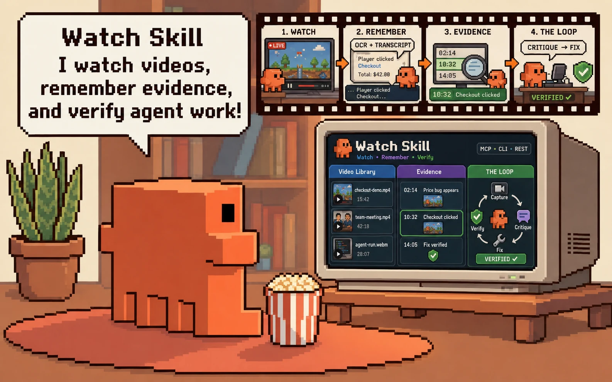
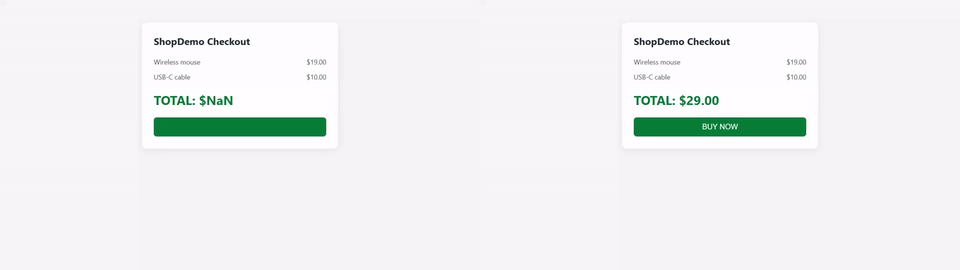
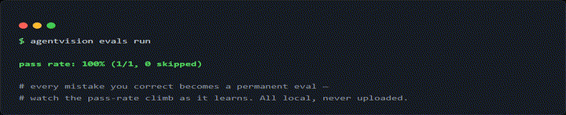
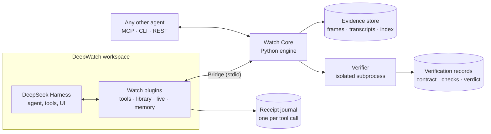

<!-- mcp-name: io.github.oxbshw/watch-skill -->
<div align="center">



# Watch Skill · DeepWatch

**Give AI agents eyes and ears — and a record of their work that something
other than the agent wrote.**

Watch Skill turns video, audio and screen activity into searchable, timestamped
evidence, and answers *did that actually work?* with a deterministic contract
instead of a model's opinion. DeepWatch is the workspace that puts an agent
inside it.

[](https://pypi.org/project/watch-skill/)
[](https://pypi.org/project/watch-skill/)
[](https://pypi.org/project/watch-skill/)
[](workspace/docs/install-and-upgrade.md)
[](https://www.skills.sh/oxbshw/watch-skill/watch)
[](docs/agents/README.md)
[](LICENSE)

[](https://github.com/oxbshw/watch-skill/actions/workflows/ci.yml)
[](https://github.com/oxbshw/watch-skill/actions/workflows/workspace-ci.yml)
[](https://github.com/oxbshw/watch-skill/actions/workflows/install.yml)

[Quickstart](#start-here) ·
[What it does](#what-it-actually-looks-like) ·
[THE LOOP](#the-loop-observe-act-verify) ·
[Architecture](#how-it-fits-together) ·
[Docs](#documentation) ·
[Community](#community)

</div>

---

## Why this exists

An agent that cannot see cannot check its own work, so it tells you what it
believes it did. Watch Skill gives it two things it did not have: **perception**
— video, audio and screen activity turned into frames, transcripts and OCR text,
every one carrying an absolute timestamp — and **verification**, a frozen
contract run by a separate process whose verdict does not come from a language
model.

Both halves are useful on their own, and the split is deliberate.

<table>
<tr>
<td width="50%" valign="top">

### Watch Skill — the engine

Index a recording once and ask it questions for as long as you keep it. Answers
cite timestamps you can open. Verification contracts check file digests, JSON
values, SQL results, HTTP responses and DOM state, and report *passed*,
*failed*, *unverified* or *inconclusive* — four answers, because three of them
are not the same as "no".

Any agent can use it: **MCP**, a **CLI**, or a **REST** API.

</td>
<td width="50%" valign="top">

###  DeepWatch — the workspace

The official [DeepSeek Harness](https://github.com/deepseek-ai/deepseek-harness)
composed with Watch Skill, so an agent's work happens *inside* something that
watches it. Every tool call leaves a receipt. Every path a tool declares is
checked against one workspace boundary. "It worked" becomes a claim you can
open.

Web workspace, a Library of what happened, and Compare for two runs of the same
contract.

</td>
</tr>
</table>

**Watch Skill is what sees and proves. DeepWatch is where the work happens.**

---

## What it actually looks like

An ordinary request — *create `totals.json` and tell me the sum*. Nobody
mentioned Watch.

<div align="center">

</div>

Every row is a receipt, every path is workspace-relative, and the total was read
back from the file rather than remembered. Then the part that matters:

<div align="center">

</div>

`watch_verify` ran a frozen contract and **Watch Core** answered. The agent did
not grade itself: a check either passed or it did not, the contract's SHA-256 is
on screen, and the same contract run from a different directory fails.

Every image on this page is a photograph of a running build.
[The screenshot page](workspace/docs/screenshots-release.md) names the build each
one came from.

---

## Start here

Three entry paths. Pick the row that describes you.

| You have | You want | Go to |
| --- | --- | --- |
| An agent already (Claude Code, Cursor, Codex, any MCP client) | Give it eyes, ears and verification | [Watch Skill](#1-add-watch-skill-to-an-agent-you-already-use) |
| Nothing yet | The whole workspace, agent included | [DeepWatch](#2-the-whole-workspace) |
| A DeepSeek Harness you already run | Add Watch to it, keep your setup | [`@deepwatch/dsh-bundle`](#3-into-a-deepseek-harness-you-already-run) |

### 1. Add Watch Skill to an agent you already use

```bash
pip install 'watch-skill[standard]'   # frames, retrieval and the MCP server
watch-skill doctor                    # checks, and repairs what it can
watch-skill watch <video-url-or-file>
watch-skill ask <id> "what changed at 3:12?"
```

**Take the extra seriously.** A bare `pip install watch-skill` gives you the
CLI, the verifier and the Bridge, and it cannot extract a frame: `watch` stops
at `perceive.missing_dependency` on the first video. `[standard]` is frames,
retrieval and MCP; add `[ocr]` to read on-screen text, `[whisper]` for local
transcription when a source has no captions, `[loop]` for the browser, or take
`[all]`. `watch-skill doctor` names the exact command for whatever is missing.

Wire it into any MCP client — `[standard]` includes the server:

```bash
watch-skill serve              # stdio MCP server, 39 tools
```

Or install the skills into 25+ agents at once:

```bash
npx skills add oxbshw/watch-skill -g
```

<div align="center">

[](docs/agents/claude-code.md)
[](docs/agents/cursor.md)
[](docs/agents/codex-cli.md)
[](docs/agents/github-copilot-cli.md)
[](docs/agents/gemini-cli.md)
[](docs/agents/cline.md)
[](docs/agents/zed.md)
[](docs/agents/windsurf.md)
[](docs/agents/opencode.md)
[](docs/agents/vscode.md)

**[Every supported client, and how far each is verified →](docs/agents/README.md)**

</div>

### 2. The whole workspace

> **Not on npm yet.** Nothing exists under the `@deepwatch` scope until the
> `deepwatch-v0.1.0` release publishes it, so the command below resolves
> nothing today. [Getting started](workspace/docs/getting-started.md) has the
> path that works from a checkout.

```bash
npm install -g @deepwatch/cli
deepwatch setup                 # builds the runtime and composes the profile
deepwatch web --workspace ./my-project
```

`@deepwatch/cli` is the package; `npm`, `npx` and `pnpm dlx` are three ways to
reach it, not three products. `deepwatch doctor` reports what is installed and
what is missing; `deepwatch setup` is the only thing that builds, and it asks
before downloading anything.

### 3. Into a DeepSeek Harness you already run

> **Not on npm yet**, the same as above — the bundle is published by
> `deepwatch-v0.1.0`. Until then, compose it from a checkout:
> [getting started](workspace/docs/getting-started.md).

```bash
dsh plugin --profile web add @deepwatch/dsh-bundle
```

That is the whole installation. The package declares `dsh.bundle.patch`, so DSH
reconciles it into the profile's layer stack and applies the patch after its
own. Four narrower variants — media, browser, memory, document — are declared
alongside it for a profile that wants one capability rather than all of them.

Add the engine with `pip install watch-skill`; the Bridge finds it on `PATH`.
Full guide: **[`@deepwatch/dsh-bundle`](workspace/packages/watch/bundle/README.md)**.

**Requirements.** Node ≥ 22.19 and Python 3.11, 3.12 or 3.13 — the versions CI
runs and the classifiers declare. Windows, macOS and Linux.

---

## THE LOOP: observe, act, verify

Perception is only half of it. THE LOOP is what an agent does with perception
when it is trying to fix something.

<div align="center">

</div>

```bash
pip install 'watch-skill[standard,loop]' && playwright install chromium

watch-skill loop start http://localhost:3000/checkout \
  "the total updates when quantity changes, and no NaN appears"
```

1. **Observe** — a real browser records the page to video; frames are extracted
   and OCR'd, each with an absolute timestamp.
2. **Critique** — a vision model is asked whether the capture meets the criteria
   you wrote. It reports issues with the timestamp each was seen at.
3. **Fix** — you change the code.
4. **Verify** — `watch-skill loop iterate` re-captures and diffs against the
   previous run, so "fixed" means the thing that was wrong is gone.

The critique step needs a vision-capable model. Without one, capture, frames,
OCR and verification still work, and the critique says it cannot judge rather
than guessing. See **[THE LOOP](docs/guides/the-loop.md)**.

### Corrections become lessons

When an answer is wrong, you correct it. Watch Skill classifies the correction,
stores it as a lesson in the local store, re-asks the question with the lesson
applied where the error class is mechanical, and counts what that saved.

<div align="center">

</div>

Lessons persist between runs and stay on your machine. Nothing learns on its
own — the correction is yours to give — and nothing is uploaded.
**[Lessons and savings](docs/guides/lessons-and-savings.md)**.

---

## What people use it for

| | |
| --- | --- |
| **Ask a video a question** | Index a recording once, then ask about it. Answers cite timestamps you can open. [`01-watch-and-ask`](examples/01-watch-and-ask) |
| **Prove an agent's work** | A deterministic contract Core runs — file digests, JSON values, SQL, HTTP, DOM. [`14-browser-verification`](examples/14-browser-verification) |
| **Fix a UI by looking at it** | Capture, critique, fix, re-verify. [`04-ui-loop`](examples/04-ui-loop) |
| **Search across everything** | One index over every source you have watched. [`03-cross-video-search`](examples/03-cross-video-search) |
| **Work offline** | Local whisper and OCR, no provider, nothing leaves the machine. [`15-private-offline-workflow`](examples/15-private-offline-workflow) |
| **Watch something live** | A stream or a browser session, bounded and cursored. [`18-live-watch`](examples/18-live-watch) |

Each is a directory you can run, with its prerequisites and expected output
written next to it.

<details>
<summary><b>All 20 examples, by what they teach</b></summary>

<br>

| | |
| --- | --- |
| Learn the core | [01 Watch and ask](examples/01-watch-and-ask) · [02 Focused moment](examples/02-focused-moment) · [03 Cross-video search](examples/03-cross-video-search) |
| Build with agents | [06 MCP and REST](examples/06-agent-integration) · [09 Framework adapters](examples/09-framework-adapters) · [15 Private offline workflow](examples/15-private-offline-workflow) |
| Understand and organise | [05 Multilingual Arabic](examples/05-multilingual-arabic) · [10 Structured extraction](examples/10-structured-extraction) · [11 Batch mode](examples/11-batch-mode) · [12 Library memory](examples/12-library-memory) · [16 Shareable viewer](examples/16-shareable-viewer) |
| Verify and improve | [04 UI loop](examples/04-ui-loop) · [07 Lessons and stats](examples/07-lessons-and-stats) · [08 Loop types](examples/08-loop-types) · [13 Self-improvement](examples/13-self-improvement) · [14 Browser verification](examples/14-browser-verification) · [17 Freshness and offline](examples/17-freshness-and-offline) · [20 Observer loop](examples/20-observer-loop) |
| Watch live | [18 Live watch](examples/18-live-watch) · [19 Live browser](examples/19-live-browser) |

That is all 20 examples; the index is **[examples/](examples/README.md)**.

</details>

---

## How it fits together


```mermaid
flowchart LR
  subgraph W["DeepWatch workspace"]
    H["DeepSeek Harness<br/>agent, tools, UI"]
    P["Watch plugins<br/>tools · library · live · memory"]
    H <--> P
  end
  P <-->|"Bridge (stdio)"| C["Watch Core<br/>Python engine"]
  C --> E[("Evidence store<br/>frames · transcripts · index")]
  C --> V["Verifier<br/>isolated subprocess"]
  V --> R[("Verification records<br/>contract · checks · verdict")]
  P --> J[("Receipt journal<br/>one per tool call")]
  A["Any other agent<br/>MCP · CLI · REST"] <--> C
```

**Watch Core is the only thing that issues a verdict.** The Host may notice,
correlate, freeze a contract and ask — it may not decide the answer. That is
[ADR-002](workspace/docs/adr/), and a build gate fails if anything under
`packages/` starts producing verdicts.

A receipt records what a tool call *did*; a verdict records what Core *checked*.
They are written by different processes and the Library shows them as different
columns, because an agent that ran a command successfully and an agent that did
the right thing are not the same claim.

More: **[architecture](docs/architecture.md)** ·
**[verification](docs/verification.md)** ·
**[the 39 tools](docs/tools/README.md)**.

---

## What works, and what it needs

| Capability | Out of the box | Needs |
| --- | --- | --- |
| Start the app, browse, read diagnostics | ✅ | nothing |
| Verification contracts, containment, receipts | ✅ | nothing |
| Video frames and scenes | with `[standard]` | `ffmpeg` ≥ 5.1 — `watch-skill doctor` installs it |
| Reading on-screen text | with `[ocr]` | a first-use model download (~80 MB) |
| Speech to text | with `[whisper]` | a first-use model download; captions are used first when a source has them |
| Chat with an agent | — | a provider you add and bind |
| Visual scene description | — | a model that can see images |
| Browser capture / THE LOOP | with `[loop]` | `playwright install chromium` |
| Memory | off | enable in Settings; the store is plaintext and says so |
| Desktop app | not distributed | run the web workspace |

DeepWatch starts, and stays useful, with no provider configured: verification,
containment, the Library and local perception are all local. What needs a
provider is the *agent* — chat, tool use, and the critique step of THE LOOP.

**Three ways a capability arrives, and they are not interchangeable.** A **local
dependency** (`ffmpeg`, `yt-dlp`, a JS runtime) runs on your machine and
`watch-skill doctor` will fetch and repair it. A **downloaded model** (OCR
weights, whisper) also runs on your machine, is a large one-time download, and
nothing about your files leaves it. A **hosted provider** — the agent's model,
and any vision model you bind — is somebody else's service, with their latency,
price and terms, and it sees what you send it. An OpenAI-compatible server you
run yourself (Ollama, vLLM, LM Studio, llama.cpp) is the hosted route pointed at
your own hardware: the data stays local, and whether a given model supports tool
calls or images is a property of that model, which DeepWatch reports rather than
works around.

Nothing reaches a provider until you add one, and holding a provider credential
is not permission to upload a frame or a transcript — that is a separate
consent.

**What repairs itself.** `watch-skill doctor` repairs *dependencies*: it
downloads `yt-dlp` and keeps it current, bootstraps a JS runtime, installs OCR
language data, and fetches `ffmpeg` where it can, reporting every repair. That
is the only thing here that acts without being asked. There is no automatic task
resumption, no autonomous learning, and no encryption at rest in this release.
**[Known limitations](workspace/docs/known-limitations.md)** is the full list.

---

## Measured, not asserted

Against a leading video-understanding API, same files, same scorer:

| | Watch Skill | Baseline |
| --- | --- | --- |
| Written-analysis groundedness | **89.7%** | 27.9% |
| Citations per 100 words | **13.23** | 0.12 |
| Frame delivery on real footage | **96.9%** | 31.2% |
| Cue starts within half a second | **100%** | 25% |

Method and fixtures: **[benchmarks/video_backends/](benchmarks/video_backends/README.md)**.
Trade-offs against the alternatives: **[comparison](docs/comparison.md)**.

---

## Documentation

| | |
| --- | --- |
| [Getting started](docs/getting-started.md) | Install, first watch, first agent connection |
| [Install and upgrade](workspace/docs/install-and-upgrade.md) | Both products, optional extras, compatibility policy |
| [Configuration](docs/configuration.md) | Settings, providers, storage locations |
| [Tool reference](docs/tools/README.md) | All 39 MCP tools and their REST/CLI counterparts |
| [Verification](docs/verification.md) | Contracts, the fourteen check types, assurance levels |
| [Architecture](docs/architecture.md) | Boundaries, data flow, extension points |
| [Agent matrix](docs/agents/README.md) | Per-client setup and how far each is verified |
| [Troubleshooting](docs/troubleshooting.md) | Dependency repair and common runtime errors |
| [Cost](docs/cost.md) | What runs free, what a provider charges for |
| [Known limitations](workspace/docs/known-limitations.md) | What this release does not do |

**DeepWatch:** [workspace README](workspace/README.md) ·
[setup](workspace/docs/setup.md) ·
[the twenty packages](workspace/docs/packages.md) ·
[releasing](workspace/docs/releasing.md) ·
[platform support](workspace/docs/platform-support.md)

Three tool counts, because they answer different questions: **39** MCP tools
from `watch-skill serve`, **22** `watch_*` tools added to an agent inside
DeepWatch, **47** tools that agent is offered in total.

---

## Community

Written by other people, about using this:

- [Watch Skill 使用教程：让 Codex 看懂视频和录屏](https://www.opcchina.ai/?p=4329) — step-by-step tutorial for wiring Watch Skill into Codex (Chinese)
- [Watch Skill: AI video analysis and video correction](https://en.aistacknav.com/watch-skill-ai-video-analysis-video-correction/) — setup and operation guide with its own use cases and troubleshooting (English)
- [Video walkthrough](https://www.bilibili.com/video/BV1XnNK6DEdr/) · [second part](https://www.bilibili.com/video/BV1eBKp6TEKh/) — Bilibili (Chinese)
- [Skills.sh](https://www.skills.sh/oxbshw/watch-skill/watch) · [SkillsMP](https://skillsmp.com/creators/oxbshw/watch-skill) — install directly from a skills directory

The full collection, separated into tutorials, video, integrations and
directory listings: **[docs/ecosystem.md](docs/ecosystem.md)**.

---

## Contributing

Issues and pull requests welcome. **[CONTRIBUTING.md](CONTRIBUTING.md)** has the
twenty-minute path: what to install, which gate to run, and how the commit
messages are shaped. Security policy: **[SECURITY.md](SECURITY.md)**. Design
decisions and their reasons: **[DECISIONS.md](docs/DECISIONS.md)** and
**[ROADMAP.md](docs/ROADMAP.md)**.

<div align="center">
<br>


Built on DeepSeek Harness · Powered by Watch Skill

DeepWatch and Watch Skill are independent projects and are not affiliated with
or endorsed by DeepSeek.

</div>
