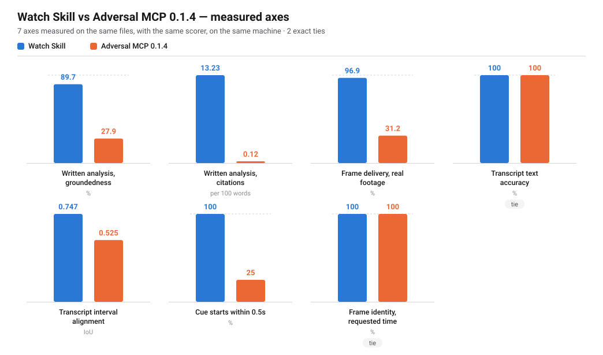

# Adversal MCP as a Watch Skill video backend

Adversal asked us to test five things in 0.1.4: timestamp precision, frame identity, frame ordering, transcript handling, and how naturally the output maps onto Watch Skill's evidence model. This is that evaluation, run against the real service a few days after release.

It is written the way we would want one written about us — measured rather than impressionistic, with the method in the open, every number reproducible from the raw JSON in [`raw/`](raw/), and every path that could not be reached named in [What was not measured](#what-was-not-measured) instead of left blank. A first release is expected to have edges; the useful thing is to say exactly where they are, with enough detail to act on.

## Executive summary

- **One reproducible bug dominates the results.** `process_video` with `timestamps` did not return on either real video: 10 of 32 requested frames arrived before the calls were abandoned, while Watch Skill's own extractor delivered 31 of 32 from the same files on the same machine in seconds. The frames the stalled calls had already written were correct and sitting on disk, so this looks like a delivery problem rather than an extraction one. It does not show up on a short clip, which is probably why it survived release. [Reliability](#reliability) has the reproduction.
- **9 of 11 gates passed**: frame order integrity (52 frames, monotonic, no inversions, and picture order followed time order); timestamp error bounded (24 exactly resolved probes, max |error| 10 ms, signed mean +10 ms — a fixed offset, not scatter); transcript alignment usable (WER 0.0%, mean cue overlap 0.52); partial evidence explicit (0 unmeasured paths, each named with a reason); …
- **Failed — frame identity**: the requested-frame path is clean across 52 frames, but every one of the 2 frames the provider chose for itself shows content from a different moment than the timestamp it carries (at least 3.0 s out).
- **Failed — errors structurally distinguishable**: 1 of 17 replies carry no status marker at all: malformed_input.

**Verdict: NOT YET QUALIFIED**

## What was exercised

| | |
|---|---|
| Provider | `adversal-mcp` 0.1.4 |
| Version established by | importlib.metadata via python.exe |
| Transport | stdio MCP (fastmcp client -> adversal-cli) |
| MCP protocol | 2025-11-25 |
| Server handshake reports | Adversal MCP Client 3.4.7 |
| Tools available | 8: `analyze`, `authenticate`, `check_remaining_quota`, `check_video_status`, `extract_frames`, `get_request_id`, `process_video`, `transcribe` |
| Run started | 2026-08-26T20:07:49+00:00 |
| Environment | Windows 10, AMD64, Python 3.11.15 |

Notes on identifying the provider:

- the MCP handshake reports server version 3.4.7, which is the FastMCP framework's version, not adversal-cli's (0.1.4); the provider version is not discoverable over MCP

## Fixture

| | |
|---|---|
| Name | `visual_events` |
| Duration | 20.4 s at 50 fps |
| Digest matches committed ground truth | yes |
| Visual events / occurrences | 39 / 40 |
| Timestamps requested | 52 |

Properties exercised: `hard-cuts-at-known-times`, `unique-visual-event-ids`, `rapid-sequential-changes`, `near-duplicate-adjacent-events`, `short-lived-event`, `repeated-visual-much-later`, `boundary-event-near-start`, `boundary-event-near-end`, `frame-exact-ladder`.

## Side by side

Watch Skill runs locally and is open source; Adversal runs a hosted pipeline behind an account. They are not the same product and are not trying to be — most of what each does has no counterpart in the other. Only the axes where both were given **the same file, the same request and the same scorer** appear below; everything else is described in prose rather than flattened into a number that would not mean anything.

Read this as a preview, not a ranking. 0.1.4 was days old when it was measured, one reproducible bug accounts for much of the difference on the frame axes, and the paths Adversal is actually built around — a hosted pipeline, a written analysis, OCR over provider-selected frames — have no local equivalent to be compared against at all. A count of who is higher on how many axes would be the least informative thing on this page.

7 axes were measurable on both sides, 2 of them exactly equal.



| axis | Watch Skill | Adversal 0.1.4 | higher | sample |
|---|---|---|---|---|
| Written analysis, groundedness | 89.7% | 27.9% | Watch Skill | 2 video(s) |
| Written analysis, citations | 13.23 | 0.12 | Watch Skill | 2 video(s) |
| Frame delivery, real footage | 96.9% | 31.2% | Watch Skill | 32 requested across 2 video(s) |
| Transcript text accuracy | 100% | 100% | equal | speech fixture, known script |
| Transcript interval alignment | 0.747 | 0.525 | Watch Skill | speech fixture, cue intervals known to the millisecond |
| Transcript cue start error (lower is better) | 0.171 s | 0.849 s | Watch Skill | speech fixture |
| Frame identity, requested time | 100% | 100% | equal | 52 probes, generated fixture |

- **Written analysis, groundedness** — Vocabulary not present in the transcript or on-screen text cannot have come from the video.
- **Written analysis, citations** — A claim with no timestamp cannot be checked against the source.
- **Frame identity, requested time** — Both sides invoke the same ffmpeg seek, so an exact tie here is the expected result rather than a finding.

**Cost.** The provider has billed 21 minutes in total for 19.18 minutes of video across 4 jobs — 1.82 minutes of that is rounding up to a whole minute per job. This particular run billed **nothing**: every file was already in the registry and submissions deduplicate on the MD5 of the bytes, so repeating the benchmark is free. 579 minutes remain. Watch Skill's side of every axis above cost nothing and ran offline.

## Written analysis

Both systems produce a Markdown write-up of a video — `notes.md` from Adversal's `analyze`, and `watch-skill notes` locally. They are scored on one thing: whether a reader could check them.

Groundedness is the share of a document's substantive vocabulary that appears somewhere in what the video actually contained — its transcript or its on-screen text. A term the video never contained cannot have come from the video. It is a coarse instrument, and it says so: a document may use a synonym the source never used and still be true. What it catches reliably is the opposite failure.

| video | system | words | grounded | timestamps cited |
|---|---|---|---|---|
| `DTu4yvmc0Fc.mp4` | Watch Skill | 2095 | **89%** | 285 (13.6/100w) |
| `DTu4yvmc0Fc.mp4` | Adversal | 2535 | **24%** | 0 (0.0/100w) |
| `RWp5cejTApU.mp4` | Watch Skill | 2683 | **91%** | 345 (12.86/100w) |
| `RWp5cejTApU.mp4` | Adversal | 2901 | **31%** | 7 (0.24/100w) |

The difference is not about writing quality, and the numbers should not be read as one document being better than the other. They are built for different jobs. Adversal's is an explainer: it takes what the video mentions and expands on it, fluently, for a reader who wants the subject explained. On the generated fixture — four synthesized sentences over coloured cards — it produced several pages on payment-gateway timeouts, ACID properties and reconciliation scripts. That is a coherent piece of writing about the topic those sentences gesture at, and someone wanting an explainer would be well served.

It is only unusable for the one job Watch Skill needs a document to do: carry evidence. None of it can be traced back to the source, so nothing in it can be cited or checked. `watch-skill notes` is narrower by design and would make a much duller explainer — it can only repeat what was observed. The measurement above is of traceability, not of merit.

## Frame identity

Timestamp correctness is not frame correctness, so identity is measured from pixels: each fixture event is a flat colour band, and a returned frame is classified by reading it. A perceptual hash is computed independently as a cross-check, and the printed label is a third opinion that never decides.

| verdict | frames |
|---|---|
| correct — the image is the event on screen at the requested time | 27 |
| near neighbour — the adjacent occurrence | 25 |
| wrong event | 0 |
| unidentified | 0 |
| named but not delivered | 0 |
| **total** | **52** |

The independent perceptual-hash channel agreed with the colour reading on 52 frames and disagreed on 0.

Byte-identical images handed back for two moments that do **not** look alike — the duplicate that would be a defect: **0**. (8 groups of byte-identical images were returned in total, which is expected: the fixture holds one static card for the length of an event, so two probes inside one event genuinely decode to the same frame.)

Expected events never returned: 1 — `LADDER_00`.

## Frame timestamp precision

Identifying a frame as a two-second event places it inside a two-second interval, which is not a millisecond measurement. The fixture therefore carries a 25-frame ladder where every frame is its own colour; there, and only there, the error is pinned to a single frame. Those probes are the measurement below. Every other probe is reported as a bound.

Probes whose error is resolved exactly: **24** of 52.

| metric | value |
|---|---|
| signed mean | +10 ms |
| mean absolute | 10 ms |
| median absolute | 10 ms |
| p95 absolute | 10 ms |
| max absolute | 10 ms |
| min absolute | 10 ms |

Percentiles are nearest-rank over the resolved probes; no interpolation.

### What the timestamps mean

0.1.4 does not say whether a frame's time is the one requested, the decoded presentation time, a scene boundary or a keyframe — so the rule was derived rather than assumed, in a form that could have come out false.

Over 24 exactly pinned probes, the returned frame matched a floor rule 0 times and a ceiling rule 24 times. **The frame returned is the first frame at or after the requested time (ceiling), not the frame being displayed at it (floor).**

A request landing exactly on a frame boundary is exact. A request between boundaries comes back up to one frame period late and never early, so the error is a bounded, signed offset rather than scatter — [0, 20 ms) at this fixture's 50 fps. 24 of 24 probes that landed exactly on a frame boundary returned the exact frame.

The timestamp the caller gets back is the time the caller asked for, echoed in the filename; the provider never states the presentation time of the frame it actually decoded.

Threshold rates are three-way on purpose. A probe whose error is bounded to "somewhere inside a 2.5-second event" is neither inside 100 ms nor outside it, and counting it either way would be a guess.

| threshold | provably within | provably outside | unresolved at this fixture's resolution |
|---|---|---|---|
| ≤ 20 ms | 24 | 0 | 28 |
| ≤ 50 ms | 24 | 0 | 28 |
| ≤ 100 ms | 29 | 0 | 23 |
| ≤ 250 ms | 36 | 0 | 16 |
| ≤ 500 ms | 39 | 0 | 13 |
| ≤ 1000 ms | 42 | 0 | 10 |

## Ordering

| check | result |
|---|---|
| frames returned | 52 |
| carrying a timestamp | 52 |
| monotonic in media time | yes |
| out-of-order pairs | 0 |
| duplicate timestamps | 0 |
| picture order matches time order | yes |
| largest gap between consecutive frames | 2.25 s |

The last row of the identity check is the one that matters: a list whose timestamps rise while its *pictures* do not is the failure that survives every check that only reads metadata, and it is what asynchronous completion order produces when it leaks into output order.

## Repeatability

3 runs of the same request against the same bytes.

| property | stable |
|---|---|
| frame count | yes |
| timestamps | yes |
| frame identities | yes |
| ordering | yes |
| returned images byte-identical | yes |

Nothing differed between runs.

Fields excluded from the comparison as per-run identifiers rather than evidence: `provider_job_id`, `request_id`, `output_path`, `temp_dir`.

## Transcript

| metric | value |
|---|---|
| WER | 0.0% |
| reference words | 26 |
| substitutions / insertions / deletions | 0 / 0 / 0 |
| cues expected / returned | 4 / 4 |
| dropped cues | 0 |
| duplicated cue texts | 0 |
| out-of-order cues | 0 |
| mean interval overlap (IoU) | 0.524544 |
| transcript source stated by provider | not stated |

Normalization for the text metrics only: lowercase; punctuation dropped; digits spelled out digit by digit; applied identically to reference and hypothesis. Timing is scored on the raw numbers — normalizing a timestamp would be scoring our own arithmetic.

- Cue start: median 849 ms, p95 1148 ms, max 1148 ms, signed mean -861 ms.
- Cue end: median 699 ms, p95 1166 ms, max 1166 ms, signed mean -840 ms.
- Cue midpoint: median 848 ms, p95 898 ms, max 898 ms, signed mean -850 ms.

## Failure semantics

Every probe below is refused by argument validation before any upload, so none costs a processing minute. Rate limits were deliberately not provoked: burning quota to read an error message is not a measurement worth taking.

| probe | asked for | classified as | reply begins |
|---|---|---|---|
| `no_source` | neither video_path nor video_url | `invalid_input` | Provide exactly one source: video_path or video_url.… |
| `both_sources` | both a path and a URL | `invalid_input` | Provide exactly one source: video_path or video_url.… |
| `missing_file` | a local path that does not exist | `invalid_input` | Video file not found: <home>\AppData\Local\Temp\ws-video-backend-dbwl_… |
| `empty_file` | a zero-byte file | `invalid_input` | Video file is not readable or is empty: <home>\AppData\Local\Temp\ws-v… |
| `malformed_input` | a text file named .mp4 | `unknown` | Could not determine the video duration: [mov,mp4,m4a,3gp,3g2,mj2 @ 000… |
| `malformed_url` | a URL that is not HTTP(S) | `invalid_input` | video_url must be a valid public HTTP(S) URL.… |
| `private_host_url` | a URL pointing at a private address | `invalid_input` | video_url must point to a public host, not a private or local IP addre… |
| `bad_timestamp` | a timestamp that is not a time | `invalid_input` | Invalid focused time window: timestamps must be seconds, MM:SS, or HH:… |
| `duplicate_timestamps` | the same timestamp twice | `invalid_input` | Invalid timestamps: duplicate timestamp values are not allowed.… |
| `timestamp_past_end` | a timestamp beyond the video duration | `invalid_input` | Invalid requested timestamp: 9999 must be earlier than the video durat… |
| `inverted_window` | end_time earlier than start_time | `invalid_input` | Invalid focused time window: end_time must be later than start_time.… |
| `timestamps_without_output` | exact frames with nowhere to put them | `invalid_input` | output_path is required when timestamps are requested.… |
| `unknown_job_status` | status for a request_id that was never issued | `not_submitted` | UNKNOWN — no job found for request_id "00000000-0000-0000-0000-0000000… |
| `artifact_before_submit` | frames for a job that does not exist | `not_submitted` | NOT SUBMITTED — no local job was found for request_id "00000000-0000-0… |
| `transcript_before_submit` | a transcript for a job that does not exist | `not_submitted` | NOT SUBMITTED — no local job was found for request_id "00000000-0000-0… |
| `artifact_no_output_path` | an artifact request with no output_path | `invalid_input` | output_path is required.… |
| `request_id_unknown_video` | the handle for a video never submitted | `not_submitted` | UNKNOWN — no request_id was found for this video hash. Call `process_v… |

16 of 17 replies were classifiable into a typed status by prefix. Unclassifiable: `malformed_input`.

## Latency and usage

| | |
|---|---|
| video duration | 20.4 s |
| frames requested | 52 |
| exact-frame path, median wall clock | 7.231 s |
| realtime factor | 0.354× |
| MCP calls made | 24 |

One MCP subprocess per call, so every call includes process start-up. The exact-frame path runs ffmpeg locally once per requested timestamp.

Cost is kept in separate rows because they are different kinds of claim, and three quantities get confused with each other constantly: what the provider has billed in total to obtain the artifacts this report is built from, what this particular execution added, and what re-rendering the report costs. A vendor's published price is not a measurement and does not appear at all.

| kind | value |
|---|---|
| measured — billed to obtain these artifacts | 21 provider minutes across 4 jobs, for 19.18 minutes of source (1.82 min of per-job rounding up to a whole minute) |
| measured — added by this execution | 0 — every file was already in the provider's registry, and submissions deduplicate on the MD5 of the bytes, so resubmitting the same media reuses its existing job |
| measured — cost of re-rendering with `--from-raw` | zero provider calls; the report is rebuilt from the committed JSON and never contacts the service |
| provider-reported | quota endpoint: 21 minutes used, 579 remaining at the measured point |
| documented pricing | not quoted here |
| inferred | none — nothing is inferred |

## Real footage

The generated fixture works because we drew it. Real footage offers no authored truth, so ground truth is derived from the file instead: the window of frames around each probe is decoded **by presentation time**, and the image the provider returned is located inside it. The question answered is not "is this the right picture" — nobody authored one — but *which frame of this file came back, and how far is it from the time we asked for*.

Most probes localize **byte-exactly**: the reference frames are decoded with the same JPEG settings the extractor uses, so the right frame comes back identical and the match is certain rather than inferred. A probe landing on a still shot cannot be localized to one frame and is reported as ambiguous, never resolved to the nearest.

No media, frames or stills from these sources are kept: reference frames exist for the length of one comparison and are deleted. Only timings leave the measurement.

### `DTu4yvmc0Fc` — local file

> **This source stalled.** The call did not return; it was abandoned on our own timeout, and the status below is ours, not the provider's. Frames it had already written were still on disk and are scored — which is the problem in miniature: work was completed, output was produced, and no result was ever delivered. See [Reliability](#reliability).

| | |
|---|---|
| duration | 356.014 s |
| resolution / rate | 1920x1080 at 25.0 fps (constant) |
| submission status | `transport_error` |
| timestamps requested | 16 |
| frames returned | 7 |
| localized byte-exactly | 7 |
| ambiguous (still shot) | 0 |
| wall clock | 120.012 s |

Local control — Watch Skill's own extractor, same file, same timestamps, same machine, run immediately before:

| | Adversal MCP | Watch Skill (control) |
|---|---|---|
| frames requested | 16 | 16 |
| frames delivered | 7 | 16 |
| wall clock | 120.012 s | 5.654 s |

The control exists to keep a provider stall from being blamed on this machine, this ffmpeg build, or this codec. It fails or succeeds under exactly the conditions the provider met.

It is a **delivery** control, not a timing one. Watch Skill writes its frames at its own JPEG quality, so they never match a reference frame byte-for-byte and fall back to pixel comparison, which cannot always separate adjacent frames of high-frame-rate footage. Read the row above for how many frames arrived, and the [baseline](#watch-skill-baseline) for how accurately.

Over the 7 probes resolved to a single frame (frame period 40.0 ms):

| metric | value |
|---|---|
| signed mean | +9 ms |
| mean absolute | 9 ms |
| median absolute | 0 ms |
| p95 absolute | 20 ms |
| max absolute | 20 ms |

Direction: 3 late, 0 early, 4 exact. Within one frame period and never early: 7 of 7 — **the same ceiling rule the generated fixture showed holds here too.**

| threshold | provably within | provably outside | unresolved |
|---|---|---|---|
| ≤ 20 ms | 7 | 0 | 9 |
| ≤ 50 ms | 7 | 0 | 9 |
| ≤ 100 ms | 7 | 0 | 9 |
| ≤ 250 ms | 7 | 0 | 9 |
| ≤ 500 ms | 7 | 0 | 9 |
| ≤ 1000 ms | 7 | 0 | 9 |

### `RWp5cejTApU` — local file

> **This source stalled.** The call did not return; it was abandoned on our own timeout, and the status below is ours, not the provider's. Frames it had already written were still on disk and are scored — which is the problem in miniature: work was completed, output was produced, and no result was ever delivered. See [Reliability](#reliability).

| | |
|---|---|
| duration | 759.274 s |
| resolution / rate | 1920x1080 at 60.0 fps (constant) |
| submission status | `transport_error` |
| timestamps requested | 16 |
| frames returned | 3 |
| localized byte-exactly | 1 |
| ambiguous (still shot) | 2 |
| wall clock | 120.018 s |

Local control — Watch Skill's own extractor, same file, same timestamps, same machine, run immediately before:

| | Adversal MCP | Watch Skill (control) |
|---|---|---|
| frames requested | 16 | 16 |
| frames delivered | 3 | 15 |
| wall clock | 120.018 s | 8.016 s |

The control exists to keep a provider stall from being blamed on this machine, this ffmpeg build, or this codec. It fails or succeeds under exactly the conditions the provider met.

It is a **delivery** control, not a timing one. Watch Skill writes its frames at its own JPEG quality, so they never match a reference frame byte-for-byte and fall back to pixel comparison, which cannot always separate adjacent frames of high-frame-rate footage. Read the row above for how many frames arrived, and the [baseline](#watch-skill-baseline) for how accurately.

Over the 1 probes resolved to a single frame (frame period 16.7 ms):

| metric | value |
|---|---|
| signed mean | +0 ms |
| mean absolute | 0 ms |
| median absolute | 0 ms |
| p95 absolute | 0 ms |
| max absolute | 0 ms |

Direction: 1 late, 0 early, 0 exact. Within one frame period and never early: 1 of 1 — **the same ceiling rule the generated fixture showed holds here too.**

| threshold | provably within | provably outside | unresolved |
|---|---|---|---|
| ≤ 20 ms | 1 | 0 | 15 |
| ≤ 50 ms | 2 | 0 | 14 |
| ≤ 100 ms | 3 | 0 | 13 |
| ≤ 250 ms | 3 | 0 | 13 |
| ≤ 500 ms | 3 | 0 | 13 |
| ≤ 1000 ms | 3 | 0 | 13 |

## Reliability

One bug accounts for most of what went wrong here, and it is the part of this report we would most want in Adversal's hands: **`process_video` with `timestamps` does not reliably return on a long HD source.** Everything below is the reproduction.

Both real sources stalled in this run (`DTu4yvmc0Fc`, `RWp5cejTApU`), delivering **10 of 32** requested frames between them before the call was abandoned. Watch Skill's own extractor, given the same files and the same timestamps on the same machine minutes earlier, delivered **31 of 32** in a few seconds.

It is not slow — the child `ffmpeg` finishes, writes a correct JPEG to the output directory, and then sits at zero CPU. One stalled process was observed idle for **over twelve minutes** after completing its work, with the finished frame already on disk. The tool never returns, so every result recorded for a stalled source is bounded by our own timeout rather than by anything the provider reported.

### What was measured

Fourteen calls requesting a **single** timestamp each, with the identical `ffmpeg` command timed separately for comparison:

| source | single-timestamp calls | child `ffmpeg` runtime |
|---|---|---|
| generated fixture, 20 s | 3 of 3 completed | 0.1–0.2 s |
| `DTu4yvmc0Fc`, 356 s, 1080p25 | 6 of 6 completed | 0.12–0.33 s |
| `RWp5cejTApU`, 759 s, 1080p60 | **4 of 8 stalled** | 0.15–1.25 s |

The pattern tracks how long the child process runs, not the file, the codec, the seek depth or the frame size: every stall was a call whose `ffmpeg` took **0.62 s or longer**, and every call under 0.56 s completed. It is not a clean threshold — a 0.70 s call completed while a 0.62 s call hung — so this reads as a **race**, not a limit. The same commands run outside the MCP server always complete, in under two seconds.

**Batching makes it much worse.** Every timestamp in one call is extracted in sequence, so the call only has to lose the race once. Single-timestamp calls on `DTu4yvmc0Fc` completed six times out of six; the sixteen-timestamp call on the same file stalled after seven.

### Why it matters for evidence

For a system that stores citations, a hang is harder to handle than an error. An error is a state Watch Skill can record, retry or surface; a call that never returns is neither success nor failure, and the frames left behind on disk are real, correct and unreported. A consumer trusting the return value throws away good evidence, and one trusting the directory ingests evidence from a call that never completed.

The batch form compounds it: one timestamp stalling costs every timestamp after it in the same call, and nothing marks the output partial.

The good news is how narrow it looks. The extraction itself is correct every time — the frames on disk are the right frames, at the right times. Whatever is going wrong sits between the child process finishing and the tool returning, which is a much smaller surface to search than the pipeline as a whole.

## Watch Skill baseline

The same fixture, the same requested times, the same scorer, against Watch Skill's own pinned-cue extraction. A narrow comparison on purpose: it compares "give me a frame at exactly T" and nothing else — not scene selection, not OCR, not transcription.

| | Adversal MCP | Watch Skill |
|---|---|---|
| correct frame identity | 27/52 | 27/52 |
| wrong event | 0 | 0 |
| frames never delivered | 0 | 0 |
| exactly resolved probes | 24 | 24 |
| signed mean error (resolved) | +10 ms | +10 ms |
| max absolute error (resolved) | 10 ms | 10 ms |
| wall clock | 7.231 s | 5.754 s |

Same fixture, same probes, same scorer. Watch Skill scales frames to 512 px wide and re-encodes as JPEG, which the identity band survives; the provider's frames are full size.

## Evidence compatibility

Whether Watch Skill could ingest this into durable evidence — not whether a human could read the value off a screen. "Native" means the backend hands the value over as a typed field. A number recovered by regex from an English sentence is *derivable with assumptions* at best, because the assumption is that the sentence keeps its wording.

| Watch Skill requirement | Adversal MCP 0.1.4 | basis |
|---|---|---|
| source identity | derivable without ambiguity | We supply the path; the backend echoes nothing that contradicts it. Watch Skill's source_alias is ours to keep either way. |
| content identity | derivable with assumptions | 0.1.4 keys its local registry on MD5 and prints it as `hash:` inside a prose reply. Recoverable by regex, not offered as a field — and MD5 is not the sha256 Watch Skill's revisions are keyed by. |
| stable video identity | derivable with assumptions | request_id is stable per submission and parseable from the reply, but it identifies a *job*, not the content; the same bytes submitted after the registry is cleared get a new one. |
| frame timestamp | native | For the exact-timestamp path the only time present is the one we asked for, encoded in the filename as `frame-003-15010ms.jpg` — the requested time rather than the decoded presentation time, which the provider never states. |
| frame artifact | native | Real JPEG files on disk at a path we chose. |
| frame identity | derivable without ambiguity | The image is a real frame from the source and was measurable against ground truth. |
| transcript | native | `transcript.json` is a JSON list of `{start, end, text}`. The text came back verbatim — 0% word error over the fixture's known script. |
| transcript interval | derivable without ambiguity | Present, but as `"00:00:04"` clock strings quantised to whole seconds — parseable without guesswork, though a second is the finest citation the transcript can support. |
| transcript source | unavailable | Nothing in `transcript.json` says whether a transcript came from embedded captions or from speech recognition. For this fixture it can only be recognition — the file carries no caption track — but that is our deduction about the source, not the provider's statement. |
| ordering | derivable without ambiguity | Filenames carry a zero-padded ordinal and the requested millisecond, so a stable order exists without trusting directory listing order. |
| provenance | derivable with assumptions | The provider version is not exposed over MCP — the handshake reports the FastMCP framework's version. It has to come from package metadata on the machine, which is provenance about our install, not about their pipeline. |
| provider-native IDs | derivable with assumptions | request_id appears only inside prose and is recovered by regex. |
| durable references | unavailable | Artifacts are files written into a directory we name. Nothing is addressable after the fact except by re-downloading with request_id, and the reply carries no checksum for what was written. |
| stale-source protection | unavailable | The backend dedupes on MD5 of the bytes, which is sound, but nothing in the output lets a caller revalidate later: no ETag, no digest of the artifact, no content-addressed handle. Watch Skill's Freshness cannot be established from a reply. |
| hashes / checksums | derivable with assumptions | MD5 of the source, in prose. No digest of any returned artifact. |
| confidence | unavailable | Nothing in 0.1.4's surface exposes a confidence for a frame, a cue or an OCR read. |
| repeatability | derivable without ambiguity | The exact-timestamp path was run repeatedly and compared field by field. |

## Qualification gates

Defined from the criteria this evaluation was set up against, before any measurement existed, then applied mechanically to the raw result so the verdict is not a matter of impression. Three outcomes rather than two: a gate whose evidence could not be gathered reads *not established*, which is deliberately neither a pass nor a failure. In this run every gate had the evidence it needed, so each one below is a pass or a fail on what was actually measured.

| gate | principle | result | detail |
|---|---|---|---|
| frame order integrity | no unexplained frame-order corruption | pass | 52 frames, monotonic, no inversions, and picture order followed time order |
| frame identity | no systematic wrong-frame identity | **FAIL** | the requested-frame path is clean across 52 frames, but every one of the 2 frames the provider chose for itself shows content from a different moment than the timestamp it carries (at least 3.0 s out) |
| timestamp error bounded | timestamp error is measured and bounded | pass | 24 exactly resolved probes, max |error| 10 ms, signed mean +10 ms — a fixed offset, not scatter |
| transcript alignment usable | transcript alignment is usable | pass | WER 0.0%, mean cue overlap 0.52 |
| partial evidence explicit | partial and missing evidence is explicit, never silent | pass | 0 unmeasured paths, each named with a reason |
| failures do not masquerade as success | an invalid request is never answered as a result | pass | 17 invalid requests, every one refused |
| errors structurally distinguishable _(advisory)_ | a caller can tell error kinds apart without reading English | **FAIL** | 1 of 17 replies carry no status marker at all: malformed_input |
| provenance preservable _(advisory)_ | what produced the evidence can be recorded with it | pass | version 0.1.4 via importlib.metadata via python.exe — readable, though not over the MCP interface itself |
| evidence maps without invented semantics | nothing has to be made up to store it as evidence | pass | every core evidence field is native or derivable |
| nondeterminism containable | run-to-run variation is confined to identifiers | pass | 3 runs identical in count, timestamps, identity and order |
| output stable enough to be durable | the same source yields the same evidence later | pass | returned images were byte-identical across runs |

## What was not measured

Every path this benchmark covers produced a measurement.

## Recommendation

Hold off on building an experimental external `VideoBackend` against 0.1.4, and revisit it once the items below land. The verdict is *not yet*, not *no* — this is a 0.1.x release days old, and the distance to qualified looks short.

What 0.1.4 gets right is worth stating first, because it is the hard part. On the generated fixture the exact-frame path returned the correct picture every single time: no wrong event, no unidentified frame, none missing, byte-identical across three runs, and a timing error that is a fixed 10 ms offset rather than scatter. Frame extraction is in good shape, and the ceiling rule behind that offset held on real 25 fps and 60 fps footage too.

The blocker is delivery rather than accuracy: on real footage the call stalls before returning the frames it has already written correctly. Fixing that is worth doing before anything else here, because it is the one item that makes the rest unmeasurable.

The backend paths were exercised, not skipped: jobs were submitted and polled to completion, and `analyze`, `transcribe` and `extract_frames` all returned artifacts that were scored. What they showed is a mix. Transcript text came back exact on the controlled fixture — not one word wrong — while its timing is quantised to whole seconds and lands materially coarser than the frame path. Provider-selected frames carried timestamps that do not match the content they show. And the interface answers in prose where a consumer storing durable evidence needs fields.

What would unblock an integration, in order:

- **frame identity** — the requested-frame path is clean across 52 frames, but every one of the 2 frames the provider chose for itself shows content from a different moment than the timestamp it carries (at least 3.0 s out).
- **errors structurally distinguishable** — 1 of 17 replies carry no status marker at all: malformed_input.

### What Adversal would need to change

Each of these is tied to something this run measured, not to a preference.

1. **A call that always returns.** `process_video` with `timestamps` stalls on a long HD source. The child `ffmpeg` finishes and writes a correct frame, then the process sits at zero CPU and the tool does not return; one was observed idle for twelve minutes with its output already on disk. Four of eight single-timestamp calls on a 1080p60 source stalled, and the same commands always complete outside the MCP server, which points at the async subprocess handling rather than at extraction. Worth fixing first — it is the only item here that blocks measuring the others.

2. **Structured tool results instead of prose.** Every tool on 0.1.4 is declared `-> str` and answers in English. Status has to be recovered by matching the first word of a paragraph, and one reply in this run carried no marker at all — raw ffprobe stderr for a malformed input. A JSON envelope with `status`, `request_id`, `error.code` and `retryable` would remove the guessing entirely.

3. **The decoded frame time, not only the requested one.** The exact-timestamp path names its files after the time that was asked for. The extractor returns the first frame at or after that time, so the file's name is up to one frame period away from the moment the picture actually shows. Returning the presentation timestamp of the frame that was decoded would make the difference visible instead of latent.

4. **Frame selection that says which rule it used.** Nothing in the output states whether a timestamp means requested time, decoded time, scene time or keyframe time. A `timestamp_kind` field would let a consumer store the right provenance rather than inferring one.

5. **A checksum for every artifact.** Artifacts arrive as files in a directory the caller named. Nothing in the reply lets that directory be verified later, so a downstream store cannot tell a complete download from a truncated one, or re-validate evidence it wrote a month ago.

6. **A content-addressed handle that outlives the local registry.** `request_id` identifies a job, and the mapping from bytes to job lives in `~/.adversal/jobs.json` on one machine. Clear that file and the same video is a new job. A stable identifier derived from the content would let evidence survive a machine change.

7. **The provider version over the interface.** The MCP handshake reports the FastMCP framework's version, not adversal-cli's. Provenance currently has to be read from package metadata on our side, which records what we installed rather than what ran.

8. **Confidence, where the pipeline has one.** No confidence is exposed for a frame, a cue or an OCR read. Watch Skill scores answers and reports an honest floor; evidence that arrives without a confidence can only ever be taken at face value.

9. **The transcript's origin, stated.** Whether a transcript came from embedded captions or from provider ASR changes how much weight it deserves. Watch Skill records that as provenance and will not infer it.

The first is a bug and blocks everything: a call that does not return cannot be built on, however good its output is. After that, structured results are the change with the most leverage — they are the container every other field on this list would arrive in, and without them each new field is another regular expression.

## Retesting when the direct API ships

Adversal have said a direct API is coming. Nothing here needs to be rewritten for it, and nothing here claims to support it — it does not exist yet.

The scorer, the ground truth and the report never see a transport: they take frames, cues and call records. Reaching the API means adding one adapter beside the MCP one and pointing the same command at it. The fixtures do not change, so the numbers are directly comparable to this run rather than to a fresh baseline.

| step | what it needs |
|---|---|
| Add `AdversalApiAdapter` | the same four methods the MCP adapter implements: `describe`, `submit`, `poll`, `fetch_frames`/`fetch_transcript` |
| Select it | one new option on the existing `bench video-backend` command — not spelled here, because the flag does not exist yet |
| Compare | the raw JSON here is the before-picture; same fixture digests, same probes, same gates |

The one thing worth re-measuring first is whether the API returns typed results. If it does, most of the interface list above closes on its own.

## Raw data

Every aggregate above is computed from [`raw/benchmark.json`](raw/benchmark.json), which carries one row per probe: the time requested, the event the fixture had on screen then, the event the returned image actually shows, the colour drift that identification cost, and the bound on the timing error. Sanitized on write — no tokens, no home directory, no account name. Job and request identifiers are kept on purpose so a run can be correlated on the provider's side.

## Reproducing this

```bash
uv run --no-sync python benchmarks/video_backends/make_fixtures.py
watch-skill bench video-backend adversal \
  --adversal-cli /path/to/adversal-cli \
  --write benchmarks/video_backends/adversal/RESULTS.md
```
