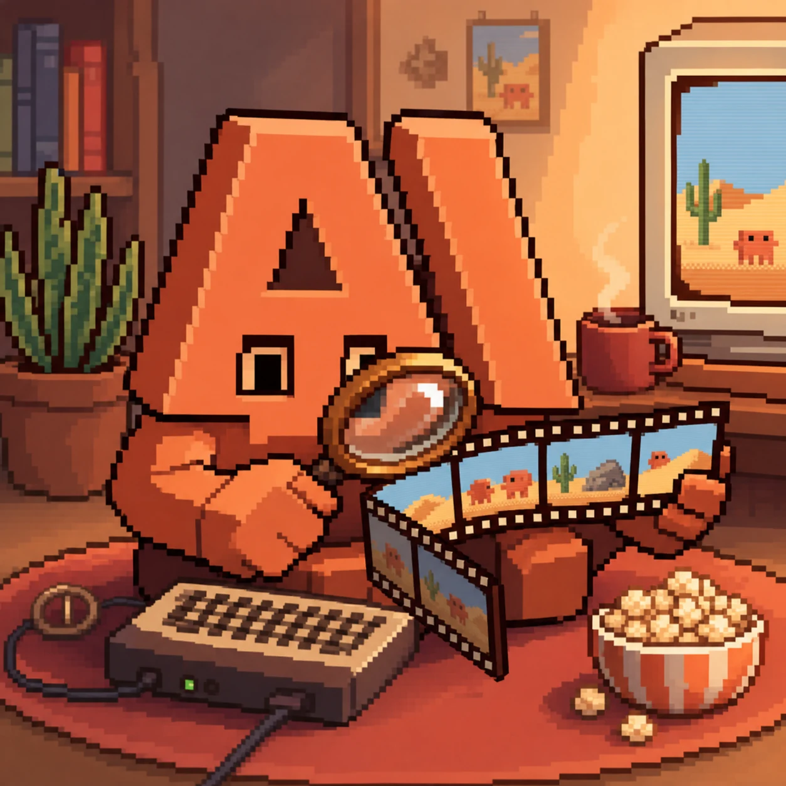
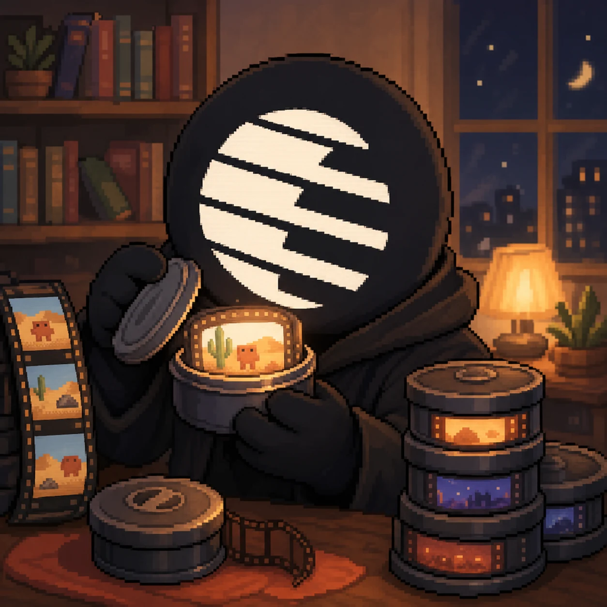
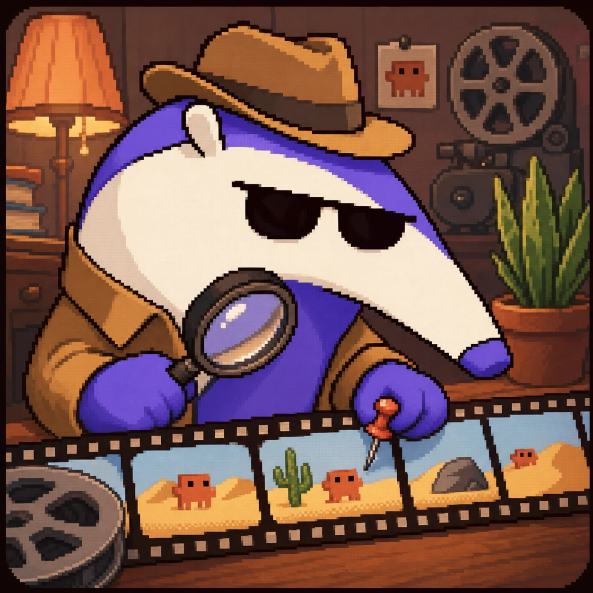

# Agent compatibility

Watch Skill exposes one engine through four connection methods. Choose the method your
agent supports; the underlying index, tools, and privacy settings are identical.

## The agents

<div align="center">

<a href="agent-zero.md" title="Agent Zero"></a>
<a href="aider.md" title="Aider"></a>
<a href="amp.md" title="Amp"></a>
<a href="claude-code.md" title="Claude Code"></a>
<a href="claude-desktop.md" title="Claude Desktop"></a>
<a href="cline.md" title="Cline (VS Code extension)"></a>
<a href="codex-cli.md" title="Codex CLI (OpenAI)"></a>
<a href="continue.md" title="Continue"></a>
<a href="cursor.md" title="Cursor"></a>
<a href="gemini-cli.md" title="Gemini CLI"></a>
<a href="github-copilot-cli.md" title="GitHub Copilot CLI"></a>
<a href="goose.md" title="Goose"></a>
<a href="hermes.md" title="Hermes Agent (and Hermes-style harnesses)"></a>
<a href="jetbrains.md" title="JetBrains IDEs"></a>
<a href="kilocode.md" title="Kilo Code"></a>
<a href="kimi-code.md" title="Kimi Code CLI"></a>
<a href="openclaw.md" title="OpenClaw"></a>
<a href="opencode.md" title="OpenCode"></a>
<a href="openhands.md" title="OpenHands"></a>
<a href="pi.md" title="Pi"></a>
<a href="qodo.md" title="Qodo Command"></a>
<a href="qwen-code.md" title="Qwen Code"></a>
<a href="roo-code.md" title="Roo Code"></a>
<a href="vscode.md" title="VS Code (native MCP / Copilot agent mode)"></a>
<a href="windsurf.md" title="Windsurf"></a>
<a href="zed.md" title="Zed"></a>

</div>

Twenty-six agents with a page of their own, plus frameworks and HTTP clients
below. Each avatar links to that agent's setup and its verification status;
the tables after this say which method it uses and how far the status has been
proven.

## What the status labels mean

| Status | Evidence required |
|---|---|
| **Machine-tested** | A real agent session connected, called tools, and received results end to end. |
| **Machine-configured** | Setup wrote a valid configuration and the exact server command completed an MCP `initialize` handshake. An in-app agent run has not yet been recorded. |
| **Documentation-verified** | The configuration matches the agent's published documentation and every fenced config block passes the repository validator. It has not been executed here. |

These labels describe integration evidence, not product quality. Run
`python scripts/validate_agent_docs.py` to check the examples in this directory.

## MCP clients

MCP is the broadest integration path. Local clients normally start `watch-skill serve`
over stdio; remote clients use the streamable HTTP endpoint.

| Agent | Configuration | Status |
|---|---|---|
| [Claude Desktop](claude-desktop.md) | `claude_desktop_config.json` | Machine-configured |
| [Cursor](cursor.md) | `~/.cursor/mcp.json` | Machine-configured |
| [Codex CLI](codex-cli.md) | `~/.codex/config.toml` | Machine-configured |
| [Cline](cline.md) | MCP settings UI / `cline_mcp_settings.json` | Documentation-verified |
| [Windsurf](windsurf.md) | `~/.codeium/windsurf/mcp_config.json` | Documentation-verified |
| [Gemini CLI](gemini-cli.md) | `~/.gemini/settings.json` | Documentation-verified |
| [VS Code Copilot](vscode.md) | `.vscode/mcp.json` | Documentation-verified |
| [GitHub Copilot CLI](github-copilot-cli.md) | `~/.copilot/mcp-config.json` | Documentation-verified |
| [Kimi Code CLI](kimi-code.md) | `~/.kimi-code/mcp.json` or `kimi mcp add` | Documentation-verified |
| [Qwen Code](qwen-code.md) | `~/.qwen/settings.json` | Documentation-verified |
| [OpenCode](opencode.md) | `opencode.json` | Documentation-verified |
| [Goose](goose.md) | `~/.config/goose/config.yaml` | Documentation-verified |
| [OpenHands](openhands.md) | `config.toml` | Documentation-verified |
| [Kilo Code](kilocode.md) | `kilo.jsonc` | Documentation-verified |
| [Qodo Command](qodo.md) | Project `mcp.json` and agent TOML | Documentation-verified |
| [Agent Zero](agent-zero.md) | Settings UI, stdio or HTTP | Documentation-verified |
| [Zed](zed.md) | `settings.json` — `context_servers`, not `mcpServers` | Documentation-verified |
| [Roo Code](roo-code.md) | `.roo/mcp.json` or global `mcp_settings.json` | Documentation-verified |
| [Continue](continue.md) | `.continue/mcpServers/watch-skill.json` | Documentation-verified |
| [JetBrains IDEs](jetbrains.md) | `.junie/mcp/mcp.json`, or AI Assistant settings | Documentation-verified |
| [Amp](amp.md) | `amp mcp add`, or the `amp.mcpServers` settings key | Documentation-verified |
| [Aider](aider.md) | No MCP client — runs the CLI through `/run` | Documentation-verified |

## Plugin and skill-native agents

Skill-native integrations add trigger guidance as well as tools. They teach the agent when
to watch, when to ask the existing index, how to cite evidence, and when to verify its own
work.

| Agent | Integration | Status |
|---|---|---|
| [Claude Code](claude-code.md) | Plugin with ten skills and MCP | Machine-tested |
| [OpenClaw](openclaw.md) | `SKILL.md` discovery | Documentation-verified |
| [Pi](pi.md) | Skills directory and CLI | Documentation-verified |
| [Hermes Agent and similar harnesses](hermes.md) | Skills, `AGENTS.md`, or REST | Documentation-verified |
| Any instruction-following coding agent | [`AGENTS.example.md`](../../templates/agent-integration/AGENTS.example.md) | Machine-tested in this repository |

## Frameworks and HTTP clients

Python adapters wrap `watch_video`, `ask_video`, and `search_videos` as native framework
tools. TypeScript and automation platforms use the REST/OpenAPI surface. The complete
setup and code samples are in the [framework adapter guide](frameworks.md).

| Framework or client | Integration | Status |
|---|---|---|
| [LangChain / LangGraph](frameworks.md#langchain--langgraph) | Native Python tools | Machine-tested |
| [CrewAI](frameworks.md#crewai) | Native Python tools | Machine-tested |
| [OpenAI Agents SDK](frameworks.md#openai-agents-sdk) | Native Python tools | Machine-tested |
| [LlamaIndex](frameworks.md#llamaindex) | Native Python tools | Unit-tested |
| [AutoGen 0.4+](frameworks.md#autogen-v04) | Native Python tools | Unit-tested |
| [Vercel AI SDK](frameworks.md#vercel-ai-sdk-typescript--via-rest) | REST tool | Documentation-verified |
| [n8n](frameworks.md#n8n--community-node-spec) | HTTP Request node / webhook | Documentation-verified |
| Any HTTP client | REST + OpenAPI | Machine-tested |
| Any remote MCP client | Streamable HTTP at `/mcp` | Machine-tested |

## Fast path

The installer runs `watch-skill setup`, which detects supported agents and offers to write
their configuration. Existing files are backed up before modification.

```bash
watch-skill setup
watch-skill doctor
```

After restarting the agent, use the same smoke test everywhere:

1. Confirm that `watch-skill` appears in the client's tool or MCP list.
2. Ask it to watch a short public video and describe a specific timestamp.
3. Ask a follow-up about the same video. The agent should use `ask_video`, not process the
   source again.

Each linked guide supplies the exact configuration and client-specific verification steps.

## Add another agent

Start with the [agent integration template](../../templates/agent-integration/README.md). A complete row
needs one working config block, one three-step smoke test, and an honest status label. See
[CONTRIBUTING.md](../../CONTRIBUTING.md#add-your-agent) for the review checklist.
