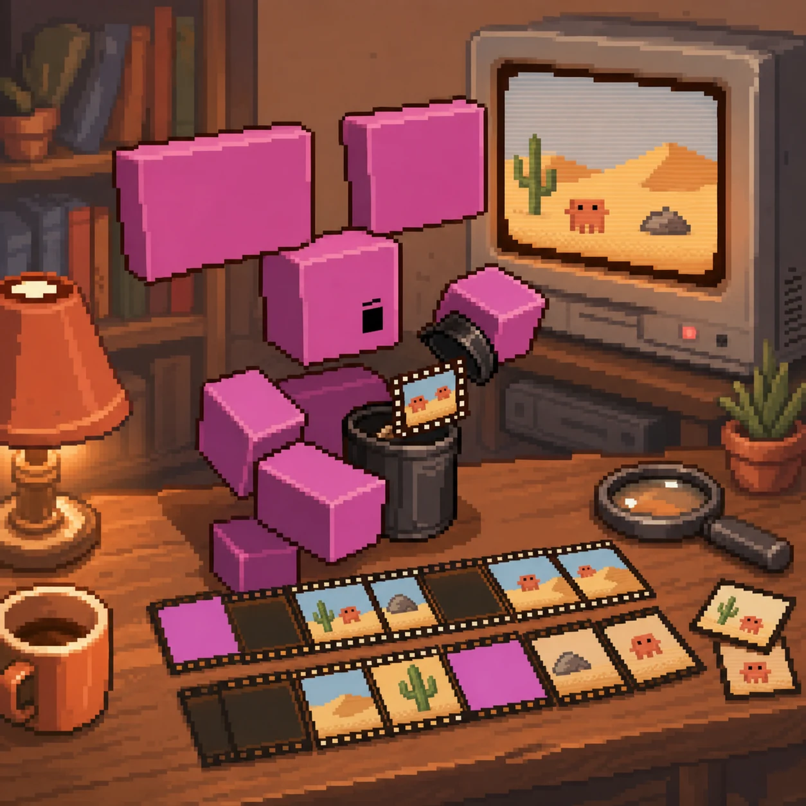

# Watch Skill in OpenCode



**Status: doc-verified ☑** — config matches the official opencode.ai MCP
docs; not executed here.

## Install

```bash
uvx --from "watch-skill[standard]" watch-skill doctor
```

`uvx` fetches the package on first use and needs no checkout. Prefer a
permanent install? `pipx install "watch-skill[standard]"`, then use
`"command": "watch-skill", "args": ["serve"]` in the config below.

<details>
<summary>From source instead (contributors)</summary>

```bash
git clone https://github.com/oxbshw/watch-skill && cd watch-skill
uv sync --extra all
uv run watch-skill doctor
```

Then run `watch-skill setup`, which writes the config pointing at your
checkout rather than the published package.

</details>

## Configure

Project: `opencode.json` in the repo root. Global:
`~/.config/opencode/opencode.json`. Local servers use `"type": "local"`
with the command as an array:

```json
{
  "$schema": "https://opencode.ai/config.json",
  "mcp": {
    "watch-skill": {
      "type": "local",
      "command": ["uvx", "--from", "watch-skill[standard]", "watch-skill", "serve"],
      "enabled": true
    }
  }
}
```

## Smoke test (3 steps)

1. `opencode`, then: *"Watch https://www.youtube.com/watch?v=aqz-KE-bpKQ
   and tell me what happens at 0:10."*
2. Approve the `watch_video` call.
3. Follow up: *"what color is the bird?"* — should call `ask_video`, no
   re-processing.

## Notes

- `"enabled": false` parks the server without deleting the entry — handy
  when you want video tools only in certain projects (put the entry in
  the project `opencode.json` instead of the global one).
