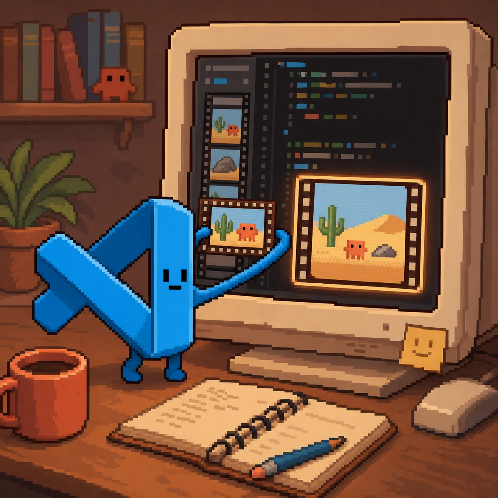

# Watch Skill in VS Code (native MCP / Copilot agent mode)



**Status: config verified against official docs, not machine-tested ☑**
(VS Code with Copilot agent mode is not set up on the development machine.)

Requires VS Code ≥ 1.99 with GitHub Copilot and agent mode enabled.

## Install

```bash
uvx --from "watch-skill[standard]" watch-skill doctor
```

`uvx` fetches the package on first use and needs no checkout. Prefer a
permanent install? `pipx install "watch-skill[standard]"`, then use
`"command": "watch-skill", "args": ["serve"]` in the config below.

<details>
<summary>From source instead (contributors)</summary>

```bash
git clone https://github.com/oxbshw/watch-skill && cd watch-skill
uv sync --extra all
uv run watch-skill doctor
```

Then run `watch-skill setup`, which writes the config pointing at your
checkout rather than the published package.

</details>

## Configure

Per-workspace `.vscode/mcp.json` (note: `servers`, not `mcpServers`):

```json
{
  "servers": {
    "watch-skill": {
      "type": "stdio",
      "command": "uvx",
      "args": ["--from", "watch-skill[standard]", "watch-skill", "serve"]
    }
  }
}
```

Or user-wide: Command Palette → *MCP: Add Server*.

## Smoke test (3 steps)

1. Command Palette → *MCP: List Servers* → `watch-skill` running.
2. Copilot Chat (Agent mode), prompt: *"Use watch-skill to watch
   https://www.youtube.com/watch?v=aqz-KE-bpKQ and tell me what happens at 0:10."*
3. Follow up: *"list indexed videos"* → `list_videos`.
