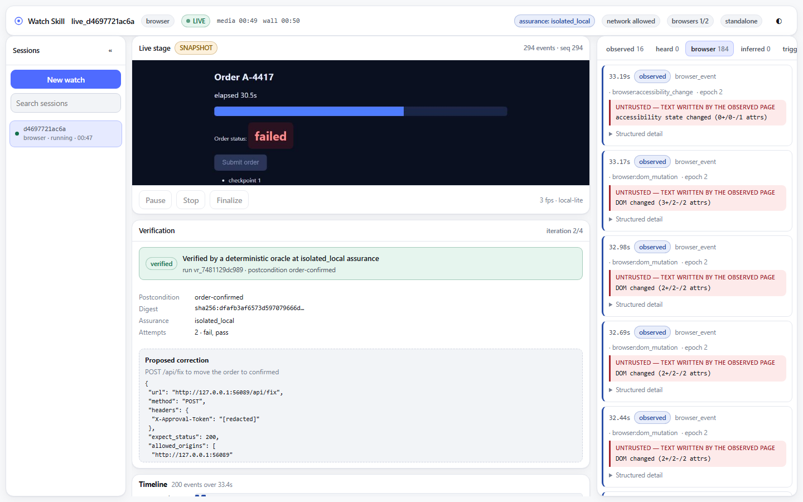

# The Watch Skill MCP App

A live workspace for watching a source and deciding whether the work actually
succeeded. It renders inside any host that supports the
[MCP Apps](https://github.com/modelcontextprotocol/ext-apps) specification,
and standalone in a local dev host for development and testing.



## What it shows

| Region | Contents |
| --- | --- |
| Header | Session id, source type, `LIVE`/`PAUSED`/`ENDED`/`FAILED`, media and wall clocks, current assurance level, policy, browser budget |
| Rail | Recent sessions, paginated, with state and a search box |
| Stage | The current frame, labelled `SNAPSHOT` or `STREAMING`, plus session controls |
| Evidence | Observed · Heard · Browser · Inferred · Triggers · Actions · Verification |
| Verification | Frozen postcondition, oracle, assurance, iteration, budgets, proposed correction, approval, receipt |
| Timeline | One lane per evidence kind, with seek |

## Opening it

One tool:

```text
watch_workspace(session=None, mode="auto")
```

- `session` — a session id, or omit for the most recent active one
- `mode` — `"auto"` opens the resolved session, `"new"` opens the start view

That is the **only** new discovery-facing tool. Everything the workspace
actually does — starting a session, approving a correction, running
verification — goes through the canonical tools that already existed, so
nothing about what the UI is permitted to do is decided in the UI.

A host that cannot render MCP Apps still gets a useful text block describing
the same canonical state.

## Version and compatibility

| Thing | Value |
| --- | --- |
| SDK | `@modelcontextprotocol/ext-apps` **1.7.5** (pinned exactly) |
| Resource MIME type | `text/html;profile=mcp-app` |
| Tool meta key | `ui/resourceUri` |
| Resource URI | `ui://watch-skill/workspace` |

Both constants are asserted against the installed package's own type
declarations by `tests/surfaces/test_workspace_app.py`. If an SDK bump moves
either, the suite fails — the alternative is a host that quietly declines to
render with no error anywhere.

**Tested against**: the standalone dev host (`watch_skill.surfaces.mcp.devhost`)
driven by Playwright/Chromium. It has **not** been tested inside Claude
Desktop, ChatGPT, or any other production MCP host — see Known limitations.

## Live data

Canonical state comes from `watch_skill.workspace`:

- `snapshot()` — everything needed for a first render, bounded, fetched on
  open and again after **every** reconnect
- `delta(session, after_seq)` — events after a cursor, bounded batches,
  monotonic sequence, explicit `gap` flag

A reported gap forces a re-snapshot rather than rendering a hole nobody can
see. Events are deduplicated by sequence and capped in client state, so a long
session cannot grow memory without limit. Polling slows to 5 s when the
document is hidden and backs off exponentially (capped at 15 s) while
disconnected.

## Media transport

Negotiated, and labelled honestly:

1. an MCP resource/blob where the host supports it;
2. a session-scoped current-frame endpoint in the standalone host;
3. otherwise the stage says it is waiting for a frame.

Periodic stills are labelled **SNAPSHOT**, never `LIVE`. The difference
between "you are watching this" and "this is what it looked like a moment ago"
matters most exactly when someone is deciding whether to intervene.

Frames are resolved by session through the evidence buffer. No filesystem path
ever reaches the client.

## Security

The resource declares:

```text
default-src 'none'; script-src 'self' 'unsafe-inline';
style-src 'self' 'unsafe-inline'; img-src 'self' data: blob:;
media-src 'self' data: blob:; connect-src 'none';
base-uri 'none'; form-action 'none'
```

No remote origin, no `eval`, no `unsafe-eval`, no CDN. The bundle is one
self-contained file and is inspected for remote references by the test suite.

**Untrusted content.** Anything a page authored is marked server-side and
rendered inside a fenced, monospaced block labelled *UNTRUSTED — text written
by the observed page*. It is shown in full and never as prose the workspace
appears to be asserting.

**Secrets never reach the client.** Action payloads are redacted in the read
model, not at render: header *names* survive so an operator can judge what
will be sent, values do not. A UI that redacted on display would still have
received the secret.

**The UI cannot fabricate anything.** It cannot mark verification successful,
cannot grant an approval, and cannot invent session state. Every mutation
carries the session version and an idempotency key; duplicate clicks are safe.

## Development

```bash
npm --prefix app install
npm --prefix app run typecheck
npm --prefix app run build
```

The build runs `tsc --noEmit` under `strict` plus
`noUncheckedIndexedAccess` and `exactOptionalPropertyTypes`, then emits a
single file to `app/dist/index.html`, which is copied to
`src/watch_skill/surfaces/mcp/static/workspace.html`.

To see it without an MCP client:

```bash
python -c "from watch_skill.surfaces.mcp.devhost import DevHost; import time; h=DevHost(8799).start(); print(h.base_url); time.sleep(3600)"
```

The dev host serves the same canonical functions the MCP tool calls. If the
two could disagree, a proof run through one would say nothing about the other.

## Known limitations

- **Not tested in a production MCP host.** The protocol shape and constants
  are pinned and asserted against the SDK, and the app is proved end to end in
  a real browser against the dev host — but no run inside Claude Desktop or
  another shipping host has happened.
- **Pause and resume are not implemented** in the live core. The buttons
  report that plainly rather than appearing to work.
- **Media is snapshot-only today.** The MCP resource/blob path is negotiated
  but falls back to the honest snapshot label.
- **The browser budget is per process**, not machine-wide.
- Assurance on this machine tops out at `isolated_local`; see
  [the Observer Loop guide](observer-loop.md).

## See also

- [Observer Loop](observer-loop.md) — what the verification panel is showing
- [Live browser](live-browser.md) — where the evidence comes from
