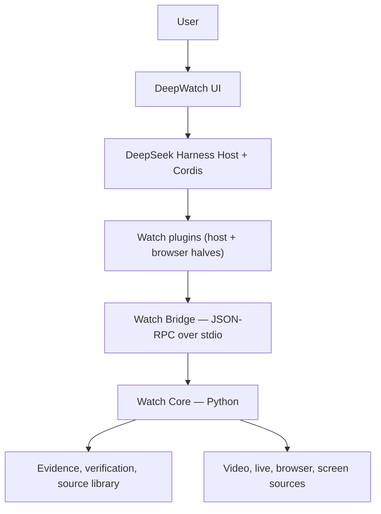

# Architecture

Watch is an evidence-native agent workspace built on DeepSeek Harness. The
whole design follows from one division of responsibility:

> **DSH orchestrates the agent and the workspace. Watch Core establishes what
> is true about the world. Watch plugins connect the two.**

Everything else — where a package lives, which gate exists, what a card is
allowed to render — is downstream of that.

## The pieces

| Owns | Component |
|---|---|
| Agent loop, sessions, context, tools, plans, jobs, plugins, workspace shell | DeepSeek Harness |
| Acquisition, perception, transcription, OCR, temporal alignment, evidence, verdicts, receipts | Watch Core |
| Presenting Watch as Cordis services, DSH tools and UI slots | Watch plugins |
| Typed transport, handshake, capability negotiation, cancellation, correlation | Watch Bridge |

## Why there is no fork

The source audit at the pinned commit found every `@deepseek-ai/dsh-*` package
published on npm at exactly `0.1.1-rc.2`. So Watch consumes DSH as a pinned
dependency, and everything it adds composes through two extension seams the
Harness already has:

- **Cordis plugin rows** — a package declaring `dsh.bundle.patch` becomes a
  profile layer on `dsh plugin add`, and its `cordis.patch.yml` is applied over
  the base and web-app layers.
- **UI slots** — 44 of them at this baseline, listed in
  [`inventory/slots.json`](../inventory/slots.json).

The patch budget is zero, and
[`scripts/verify-bundle.mjs`](../scripts/verify-bundle.mjs) enforces the part
of that promise nothing else would catch: a patch row whose id collides with an
upstream row does not add anything, it *replaces* that row's config. See
[ADR-001](adr/ADR-001-dsh-foundation.md).

## The three state machines

The product's central claim is that it can answer "did that actually work?"
independently of what the agent said. That requires keeping three things apart
that prose runs together:

| State machine | States | Answers |
|---|---|---|
| Agent execution | queued, running, completed, failed, cancelled | Did the agent finish? |
| Evidence health | current, stale, gap, expired, unavailable | Do we have a valid observation? |
| Verification | UNVERIFIED, VERIFIED, FAILED, INCONCLUSIVE, STALE, BLOCKED | Was the outcome established? |

`Agent: completed` with `Verification: UNVERIFIED` is a normal outcome. It is
never rendered green — [ADR-002](adr/ADR-002-truth-ownership.md), enforced in
`verdictTone()` and tested in `tests/presentation.test.mjs`.

Confidence never substitutes for a verdict, at any value.

## Capability truth

A code path existing is not evidence that a capability works. Five statuses,
and the difference between them is the point:

| Status | Means |
|---|---|
| `machine_tested` | a real operation ran here and succeeded |
| `probed` | a cheap check passed — a binary resolved, a directory exists |
| `implemented` | wired up, never exercised on this machine |
| `unavailable` | known not to work here, with a reason and a fix |
| `not_tested` | never checked — deliberately distinct from `unavailable` |

Only `machine_tested` and `implemented` are offered to a user as usable. A
`probed` capability is a resolved binary and nothing more; a surface that
treats it as more will eventually offer a button that fails.

## The Bridge

JSON-RPC 2.0 over stdio to a local child process, framed with
`Content-Length` headers. See [ADR-004](adr/ADR-004-bridge-contract.md).

stdio rather than a loopback port because it has nothing to secure: no port to
bind, no CORS, no shared secret. The cost is that stdout belongs to the
protocol — Watch Core claims a private duplicate at startup and redirects its
own stdout to stderr, so a stray print cannot corrupt the stream.

Length-prefixed framing rather than newline-delimited JSON because the payloads
are transcripts and OCR text, and a frame that content can split is a frame
content will eventually split.

### What the semantics buy

- A **deadline** reports "inspect the receipt", never "safe to retry". A
  request that timed out is not evidence the work did not happen.
- A **cancellation** of a dispatched call reports `cancel_requested`, never
  "cancelled". Only the receipt knows whether the effect landed.
- Every **side-effecting command** carries `operation_id`, `idempotency_key`
  and `input_digest`, so a reconnect replays the receipt instead of reissuing
  the click.
- The engine's own **error contract** passes through verbatim, because the
  `fix` it supplies is better than one invented at the boundary.

## Contract drift

Watch Core's Pydantic models are the semantic source of truth; the TypeScript
types are a face over the JSON Schema emitted from them. The failure that
invites is quiet — a renamed field, a still-compiling Workspace, an `undefined`
in production.

So Watch Core publishes a digest per contract family and reports them in the
handshake; the Bridge compares them against the digests its build was written
against. The response is scoped: a changed verification schema takes
verification offline and leaves library search alone.

Two cases are handled deliberately. A family the engine *stopped* publishing
counts as drift — treating silence as agreement would make the check
meaningless. An engine publishing *nothing at all* predates the check, and
reports as "contract unverified" while continuing to work.

Regenerate with `python scripts/gen_bridge_schemas.py` in `watch-skill`.

## The two halves, and their release trains

One repository, `oxbshw/watch-skill`, and two products in it that ship
separately.

| Half | Where | Contents | Release train |
|---|---|---|---|
| Watch Skill | repository root | Python Core, MCP, REST, CLI, Bridge, contracts, evals | PyPI, `core-v*` |
| DeepWatch | `workspace/` | DSH distribution, Watch plugins, Web, Desktop | npm, `deepwatch-v*` |

Watch Core runs headless with no Node present, and DSH boots with no Watch
present. Both directions are tested. See
[ADR-003](adr/ADR-003-repository-split.md).

## Where the rules live

A rule that governs what a screen may imply lives in
`@deepwatch/dsh-contracts`, not in a component — "green belongs to VERIFIED
alone" holds the same whether the renderer is a React card, a terminal summary
or a CI annotation. One place to change, one place to test.

## Attribution

**Built on DeepSeek Harness · Powered by Watch Skill**

DeepWatch and Watch Skill are independent projects and are not affiliated with
or endorsed by
DeepSeek. See [THIRD_PARTY_NOTICES.md](../THIRD_PARTY_NOTICES.md).
