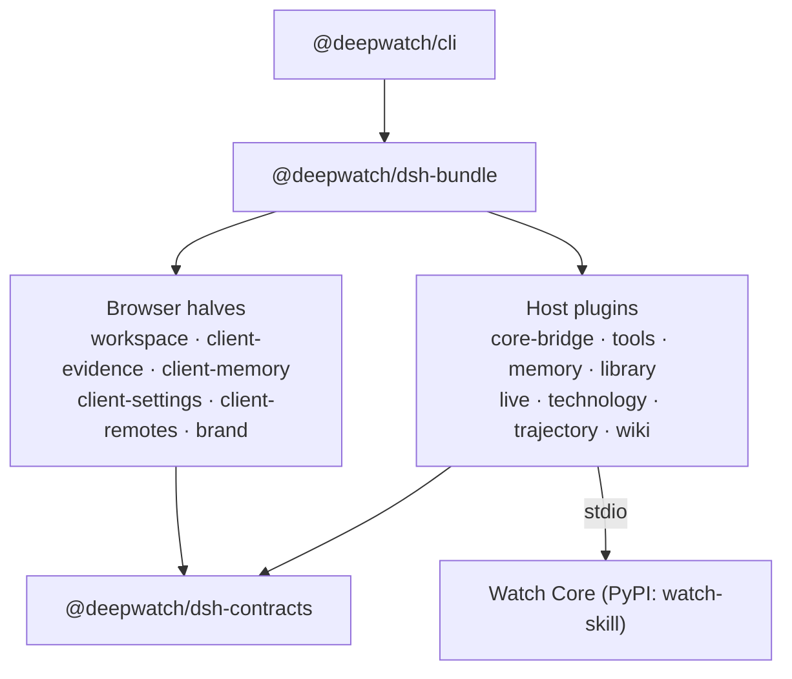

# The twenty packages

DeepWatch publishes twenty packages to npm under the `@deepwatch` scope. Two of
them are things you install on purpose. The other eighteen are what those two
are made of, and they are published for one reason: a dependency that is not on
the registry is a package that does not install.

This page is the map. Each package's own page has its exports, peers and
configuration; this is where you find out **which of them you should care
about**.

Version policy, upgrade path and compatibility: [install and
upgrade](install-and-upgrade.md). How a release is produced:
[releasing](releasing.md).

---

## Install these

| Package | What it is | Install it when |
| --- | --- | --- |
| [`@deepwatch/cli`](../packages/watch/cli#readme) | The `deepwatch` command: `doctor`, `setup`, `web`, `desktop`. Builds the managed runtime, composes the agent profile and serves the workspace. | You want the whole product and do not already run a Harness. |
| [`@deepwatch/dsh-bundle`](../packages/watch/bundle#readme) | A DSH bundle patch. Declares `dsh.bundle.patch`, so `dsh plugin add` reconciles Watch's plugins into a profile you already have. | You already run DeepSeek Harness and want to add Watch to it. |

Everything below arrives as a dependency of one of those two. Installing one
directly is for embedding a single piece in a composition you control — a real
use, and not the common one.

---

## Host plugins

They run in the DSH host process, beside the agent.

| Package | Responsibility |
| --- | --- |
| [`@deepwatch/dsh-core-bridge`](../packages/watch/core-bridge#readme) | The typed Bridge between the Harness and Watch Core over stdio. Every request to Core goes through here, and nothing else talks to Core. |
| [`@deepwatch/dsh-tools`](../packages/watch/tools#readme) | Watch capabilities registered as agent tools — the 22 `watch_*` tools an agent is offered. Also where a tool call becomes a receipt. |
| [`@deepwatch/dsh-memory`](../packages/watch/memory#readme) | Durable, correctable, scoped memory over an append-only event ledger. Off by default; the store is plaintext and says so. |
| [`@deepwatch/dsh-library`](../packages/watch/library#readme) | Sources, revisions, index state, search, facets and collections — the Library the workspace browses. |
| [`@deepwatch/dsh-live`](../packages/watch/live#readme) | Live mode: cursors, gaps, one clock, reconnect policy and a bounded buffer. |
| [`@deepwatch/dsh-technology`](../packages/watch/technology#readme) | Technology descriptors, capability lifecycle and role bindings over DSH Models and Providers. What "this model can see images" is recorded as. |
| [`@deepwatch/dsh-trajectory`](../packages/watch/trajectory#readme) | Watch records inside the Harness Trajectory, with unified selection, deep links and replay. |
| [`@deepwatch/dsh-wiki`](../packages/watch/wiki#readme) | Deterministic workspace wiki projections over the memory ledger. Same ledger in, same pages out. |
| [`@deepwatch/dsh-tenancy`](../packages/watch/tenancy#readme) | Tenants, roles, remote workers, sharing and audit — enforced server-side, never in the browser. |

## Browser halves

They run in the workspace UI. Each is the client counterpart of a host plugin
and is loaded through the DSH client loader contract.

| Package | Surface |
| --- | --- |
| [`@deepwatch/dsh-workspace`](../packages/watch/workspace#readme) | The product shell: modes, header, inspector, sensory timeline. |
| [`@deepwatch/dsh-client-evidence`](../packages/watch/client-evidence#readme) | Verdict and evidence presentation for Watch tool results — the VERIFIED card, the check list, Compare. |
| [`@deepwatch/dsh-client-memory`](../packages/watch/client-memory#readme) | Memory surfaces: taste, timeline, wiki, decisions, lessons, failures, sources. |
| [`@deepwatch/dsh-client-settings`](../packages/watch/client-settings#readme) | The Technology & Capability Center: role bindings, engines, sources, memory, verification, diagnostics. |
| [`@deepwatch/dsh-client-remotes`](../packages/watch/client-remotes#readme) | Mounts Watch's generated Typert Remote into `ctx.remote`, so the client calls the host through one generated surface. |
| [`@deepwatch/dsh-client-brand`](../packages/watch/brand#readme) | Product identity and the semantic status tokens every other surface reads. Also where the attribution and independence statements live. |

## Shared and optional

| Package | Purpose |
| --- | --- |
| [`@deepwatch/dsh-contracts`](../packages/watch/contracts#readme) | The Bridge wire contracts shared by the host plugins and the browser halves. Changing a shape here changes both sides at once, which is the point. |
| [`@deepwatch/dsh-sdk`](../packages/watch/sdk#readme) | The third-party capability developer path — declare, probe, observe, request. For building a Watch capability of your own. |
| [`@deepwatch/dsh-adapters`](../packages/watch/adapters#readme) | Optional exports: Obsidian vaults and LLMWiki bundles. Watch works fully without either. |

---

## Not published

| | |
| --- | --- |
| `@deepwatch/desktop` | The Electron shell around the same workspace packages. Marked `private`, and this release does not distribute a desktop application. `npm run smoke:desktop` proves the shell starts and its context isolation holds; that is a build check, not a download. Run the web workspace. |
| `@deepwatch/monorepo` | The workspace root. Never published. |

---

## How they fit

`@deepwatch/dsh-bundle` depends on thirteen packages and is what a profile
normally names. `@deepwatch/cli` depends on the bundle and adds the setup,
doctor and serve commands around it.

The publication order is derived from this graph rather than written down, so
every version resolves the moment it is public —
`node workspace/scripts/publish-order.mjs` prints it.

---

## Versioning

All twenty move together and share the workspace version. `0.1.0` is a stable
release: tested, documented and supported — **not 1.0**. Semantic versioning
gives `0.x` no compatibility guarantee across minor versions, so a `0.MINOR`
bump may change or remove surface and a patch will not. Depend on a tilde range
(`~0.1.0`) if you want that enforced by your lockfile rather than by a
changelog.

Watch Core versions independently, on PyPI, and the Bridge negotiates a protocol
range rather than a version match. The compatibility matrix is in
[`release-manifest.json`](release-manifest.json).
